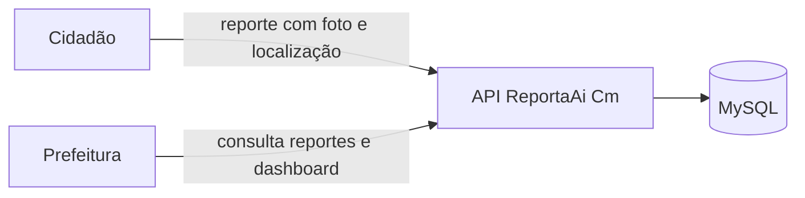

# ReportaAi Cm (Backend)

API do **ReportaAi Cm**, plataforma para que os moradores de **Campo Mourão (PR)** reportem buracos no asfalto e para que a prefeitura acompanhe e analise esses reportes.

> **Status:** em desenvolvimento (Projeto Integrador). A base do projeto está configurada, e as funcionalidades de negócio começam a ser implementadas nas próximas sprints.

## Sumário

- [Sobre o projeto](#sobre-o-projeto)
- [Stack](#stack)
- [Pré-requisitos](#pré-requisitos)
- [Instalação e execução local](#instalação-e-execução-local)
- [Variáveis de ambiente](#variáveis-de-ambiente)
- [Comandos disponíveis](#comandos-disponíveis)
- [Estrutura de pastas](#estrutura-de-pastas)
- [Documentação](#documentação)
- [Contribuindo](#contribuindo)

## Sobre o projeto

Buracos no asfalto afetam a segurança e o dia a dia de quem circula pela cidade, mas nem sempre chegam ao conhecimento da prefeitura de forma organizada. O ReportaAi Cm conecta quem encontra o problema a quem pode resolvê-lo.

A plataforma atende dois públicos:

### 1. Cidadãos

Qualquer morador de Campo Mourão pode **abrir um reporte** de buraco no asfalto:

- a **localização** do problema é capturada no momento do reporte;
- o cidadão envia uma **foto** do buraco.

> O que acontece com o reporte depois de aberto (acompanhamento, status e retorno ao cidadão) ainda está em definição.

### 2. Prefeitura (usuários administrativos)

Os servidores do município têm acesso a uma área administrativa, onde podem:

- **visualizar os reportes** enviados pelos cidadãos;
- **analisar os dados em um dashboard**, com os impactos e a distribuição dos problemas pela cidade.

> Os indicadores e as análises do dashboard ainda estão em definição.

### Papel deste repositório

Este repositório contém a **API backend**, que recebe os reportes (localização e imagem), armazena os dados e os disponibiliza para as aplicações dos cidadãos e da prefeitura.



## Stack

| Camada                | Tecnologia                                           |
| --------------------- | ---------------------------------------------------- |
| Linguagem             | TypeScript 6.0                                       |
| Framework             | NestJS 12                                            |
| Banco de dados        | MySQL 9.7 (Docker)                                   |
| ORM e migrations      | TypeORM 1.1                                          |
| Validação de ambiente | Zod + `@nestjs/config`                               |
| Testes                | Jest + ts-jest + `@nestjs/testing`                   |
| Qualidade de código   | ESLint + Prettier + Husky + lint-staged + commitlint |
| Integração contínua   | GitHub Actions                                       |

Todas as dependências usam **versão exata** (sem `^` ou `~`). O [.npmrc](.npmrc) define `save-exact=true`, então `npm install <pacote>` já grava a versão exata.

## Pré-requisitos

- **Node.js 24.11+**: a versão está no [.nvmrc](.nvmrc). Com o nvm, rode `nvm use`.
- **Docker** com o **Docker Compose**, para o banco de dados local.
- **Git**.

## Instalação e execução local

```bash
# 1. Clone o repositório e entre na branch de desenvolvimento
git clone https://github.com/jgtsuchiya/projeto_integrador_reportaAiCm_backend.git
cd projeto_integrador_reportaAiCm_backend
git switch develop

# 2. Instale as dependências (também ativa os hooks do Git)
npm install

# 3. Crie o arquivo de ambiente
cp .env.example .env

# 4. Suba o MySQL em Docker e aplique as migrations
npm run db:up
npm run migration:run

# 5. Inicie a API em modo de desenvolvimento
npm run start:dev
```

Para verificar se está tudo certo, acesse **http://localhost:3000/api/health**. A resposta esperada é `{"status":"ok", ...}`.

> O MySQL do Docker usa a porta **3307**, para não conflitar com um MySQL instalado localmente. Todas as rotas da API ficam sob o prefixo `/api`.

## Variáveis de ambiente

O modelo está em [.env.example](.env.example). As variáveis são validadas quando a aplicação sobe: se alguma estiver faltando ou inválida, a API não inicia e mostra qual variável está errada.

| Variável           | Obrigatória | Padrão        | Descrição                                         |
| ------------------ | ----------- | ------------- | ------------------------------------------------- |
| `NODE_ENV`         | não         | `development` | `development`, `test` ou `production`             |
| `PORT`             | não         | `3000`        | Porta HTTP da API                                 |
| `DB_HOST`          | sim         | (nenhum)      | Host do MySQL                                     |
| `DB_PORT`          | não         | `3306`        | Porta do MySQL (`3307` no Docker local)           |
| `DB_USERNAME`      | sim         | (nenhum)      | Usuário do banco                                  |
| `DB_PASSWORD`      | sim         | (nenhum)      | Senha do banco                                    |
| `DB_DATABASE`      | sim         | (nenhum)      | Nome do banco                                     |
| `DB_LOGGING`       | não         | `false`       | Exibe as queries SQL no log                       |
| `DB_ROOT_PASSWORD` | só Docker   | (nenhum)      | Senha de root do MySQL, usada pelo docker-compose |

O [.env.test](.env.test) sobrescreve o banco para `reportaai_cm_test` nos testes de integração. Mais detalhes em [docs/DATABASE.md](docs/DATABASE.md).

## Comandos disponíveis

**Desenvolvimento e build**

| Comando               | O que faz                                     |
| --------------------- | --------------------------------------------- |
| `npm run start:dev`   | Inicia a API com reload automático            |
| `npm run start:debug` | Inicia com reload e o debugger do Node        |
| `npm run build`       | Compila para `dist/`                          |
| `npm run start:prod`  | Executa a versão compilada (`node dist/main`) |

**Qualidade de código**

| Comando                | O que faz                                  |
| ---------------------- | ------------------------------------------ |
| `npm run lint`         | Verifica o projeto com ESLint              |
| `npm run lint:fix`     | Corrige automaticamente o que for possível |
| `npm run format`       | Formata os arquivos com Prettier           |
| `npm run format:check` | Verifica a formatação sem alterar arquivos |
| `npm run typecheck`    | Checa os tipos do TypeScript               |

**Testes**

| Comando                    | O que faz                                               |
| -------------------------- | ------------------------------------------------------- |
| `npm test`                 | Roda os testes unitários                                |
| `npm run test:watch`       | Roda os testes unitários em modo watch                  |
| `npm run test:cov`         | Gera o relatório de cobertura em `coverage/`            |
| `npm run test:integration` | Roda os testes de integração com MySQL (requer `db:up`) |

**Banco de dados e migrations**

| Comando                                                                     | O que faz                                     |
| --------------------------------------------------------------------------- | --------------------------------------------- |
| `npm run db:up`                                                             | Sobe o MySQL em Docker e aguarda ficar pronto |
| `npm run db:down`                                                           | Para o container (os dados são mantidos)      |
| `npm run migration:run`                                                     | Aplica as migrations pendentes                |
| `npm run migration:revert`                                                  | Desfaz a última migration                     |
| `npm run migration:show`                                                    | Lista as migrations e o status de cada uma    |
| `npm run migration:generate -- src/shared/infra/database/migrations/<Nome>` | Gera uma migration a partir das entidades     |

## Estrutura de pastas

```
.
├── src/
│   ├── main.ts                # inicialização da API (prefixo /api)
│   ├── app.module.ts          # módulo raiz
│   ├── config/                # validação das variáveis de ambiente
│   ├── shared/                # código compartilhado entre módulos
│   │   ├── domain/            # classes base do domínio (ex.: Entity)
│   │   ├── application/       # contratos genéricos (ex.: UseCase)
│   │   └── infra/database/    # conexão, data source e migrations
│   └── modules/               # um módulo por funcionalidade
│       └── <feature>/
│           ├── domain/        # entidades e regras de negócio
│           ├── application/   # casos de uso
│           ├── infra/         # banco de dados e integrações externas
│           └── presentation/  # controllers HTTP e DTOs
├── test/                      # testes de integração e e2e
├── docs/                      # documentação técnica
├── docker/                    # scripts de inicialização do MySQL
├── .github/                   # CI, template de PR e rulesets
└── docker-compose.yml         # MySQL para desenvolvimento local
```

Cada funcionalidade é um módulo independente, dividido em camadas. As regras de dependência entre as camadas são verificadas pelo ESLint. Os detalhes estão em [docs/ARCHITECTURE.md](docs/ARCHITECTURE.md).

## Documentação

| Documento                                    | Conteúdo                                                                       |
| -------------------------------------------- | ------------------------------------------------------------------------------ |
| [docs/ARCHITECTURE.md](docs/ARCHITECTURE.md) | Camadas, regras de dependência, nomenclatura, aliases e como criar uma feature |
| [docs/DATABASE.md](docs/DATABASE.md)         | Banco local, variáveis de ambiente, entidades e migrations                     |
| [docs/TESTING.md](docs/TESTING.md)           | Tipos de teste, o que testar em cada camada e convenções                       |
| [CONTRIBUTING.md](CONTRIBUTING.md)           | Git Flow, padrão de commits, Pull Requests e releases                          |

## Contribuindo

O projeto segue o **Git Flow** (`main` para produção e `develop` para integração), com commits no padrão **Conventional Commits**:

```bash
git switch develop && git pull
git switch -c feature/12-cadastro-de-reporte
git commit -m "feat(reports): cria endpoint de cadastro de reporte"
```

Os hooks do Git validam o código, a mensagem de commit e o nome da branch. Os Pull Requests para a `develop` precisam de aprovação e do CI passando. O fluxo completo está no [CONTRIBUTING.md](CONTRIBUTING.md).

> > > > > > > Stashed changes

## Contribuindo

Git Flow (`main` para produção e `develop` para integração) com commits no padrão Conventional Commits. Os nomes de branch e as mensagens de commit são validados pelos hooks do Husky, e os PRs precisam de aprovação e do CI passando.

```bash
git switch develop && git pull
git switch -c feature/12-cadastro-de-denuncia
git commit -m "feat(reports): cria endpoint de cadastro de denúncia"
```

O fluxo completo (branches, releases, hotfixes, commits, PRs e configuração do GitHub) está em [CONTRIBUTING.md](CONTRIBUTING.md).
