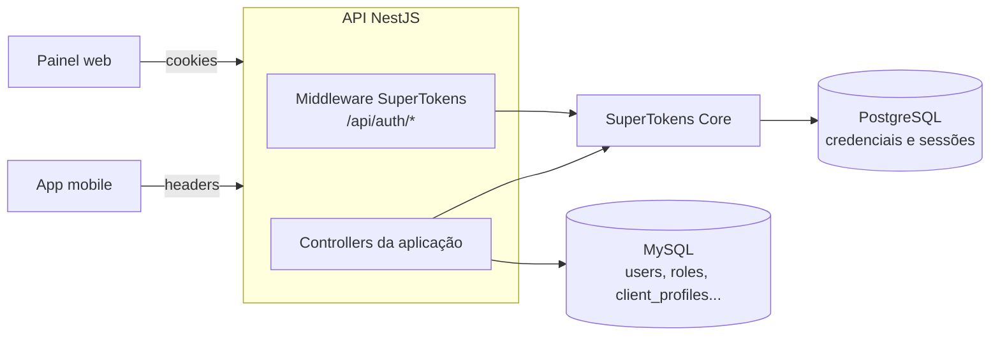
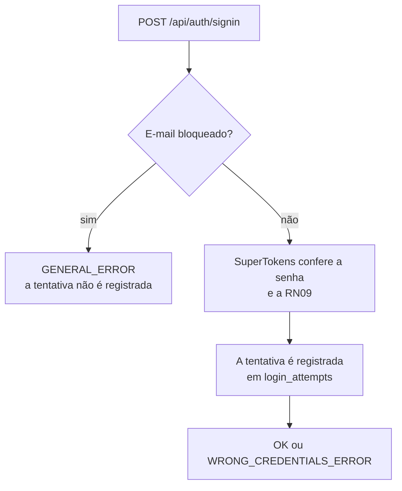
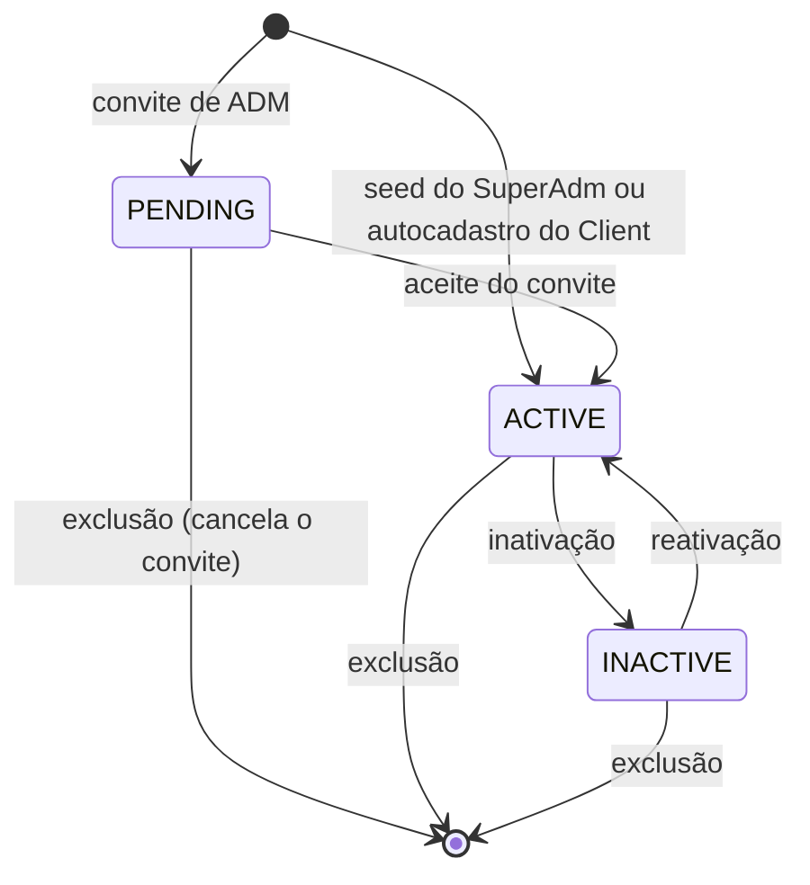
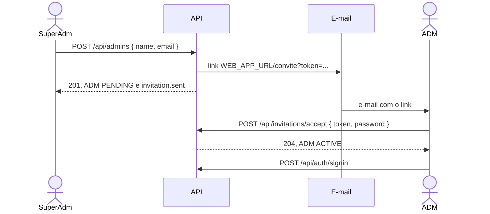
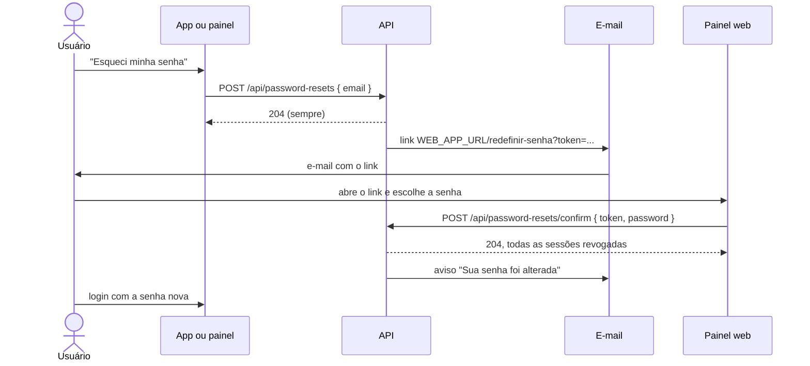

# Autenticação e autorização

A autenticação é feita pelo **SuperTokens** self-hosted, integrado pelo SDK `supertokens-node` (sem o `supertokens-nestjs`). Este documento explica como a integração funciona, quem pode acessar cada rota e como proteger uma rota nova.

> Para consumir a API pelo painel web ou pelo app, veja o [FRONTEND.md](FRONTEND.md). As requisições prontas de todas as rotas estão em [api.http](api.http).

## Sumário

- [Visão geral](#visão-geral)
- [SuperTokens Core](#supertokens-core)
- [Integração com o NestJS](#integração-com-o-nestjs)
- [Rotas nativas do SuperTokens](#rotas-nativas-do-supertokens)
- [O que foi customizado](#o-que-foi-customizado)
- [Bloqueio do login por tentativas](#bloqueio-do-login-por-tentativas)
- [Limite de requisições por IP](#limite-de-requisições-por-ip)
- [Sessão: cookie ou header](#sessão-cookie-ou-header)
- [O que o AuthGuard faz a cada requisição](#o-que-o-authguard-faz-a-cada-requisição)
- [Matriz de permissões](#matriz-de-permissões)
- [Como proteger uma rota nova](#como-proteger-uma-rota-nova)
- [Ciclo de vida das contas](#ciclo-de-vida-das-contas)
- [Recuperação de senha](#recuperação-de-senha)
- [Formato dos erros](#formato-dos-erros)
- [Fora do escopo](#fora-do-escopo)

## Visão geral



| Onde                                  | O que guarda                                                                                                    |
| ------------------------------------- | --------------------------------------------------------------------------------------------------------------- |
| SuperTokens Core (PostgreSQL próprio) | Credenciais (e-mail e hash da senha, em argon2), sessões e uma cópia do papel de cada usuário                   |
| MySQL                                 | `users`, `roles`, `client_profiles` e `user_tokens`. É a **fonte da verdade** de papel, status e dados pessoais |

Três pontos valem para todo o resto do documento:

- **O id é o mesmo nos dois lados.** O SuperTokens gera o id ao criar a credencial, e esse id vira o `users.id`.
- **Quem decide o acesso é o MySQL.** O SuperTokens responde só "esta senha confere?" e "esta sessão é válida?". Se o usuário pode entrar (status) e o que ele pode fazer (papel) é conferido no MySQL, no login e a cada requisição.
- **O papel no token é só uma cópia.** O UserRoles do SuperTokens coloca o papel no access token (claim `st-role`), mas a API não autoriza por ele.

Os três papéis:

| Papel         | Quem é                            | Como a conta é criada                                                |
| ------------- | --------------------------------- | -------------------------------------------------------------------- |
| `SUPER_ADMIN` | Administrador principal do painel | Só pelo `npm run seed` ([DATABASE.md](DATABASE.md#seed-do-superadm)) |
| `ADMIN`       | Servidor da prefeitura, no painel | Convite por e-mail feito pelo SuperAdm (`POST /api/admins`)          |
| `CLIENT`      | Cidadão, no app mobile            | Autocadastro (`POST /api/clients`)                                   |

## SuperTokens Core

O Core roda em Docker, pelo [docker-compose.yml](../docker-compose.yml), e sobe junto com o MySQL no `npm run db:up`:

| Serviço          | Imagem                                      | Porta no host | Papel                                                              |
| ---------------- | ------------------------------------------- | ------------- | ------------------------------------------------------------------ |
| `supertokens`    | `supertokens/supertokens-postgresql:12.2.0` | 3567          | O Core. A API fala só com ele, em `SUPERTOKENS_CONNECTION_URI`     |
| `supertokens-db` | `postgres:18.6-alpine`                      | (nenhuma)     | Banco exclusivo do Core, que não suporta MySQL. Só o Core o acessa |

Para conferir se o Core está no ar: `curl http://localhost:3567/hello` responde `Hello`.

As configurações abaixo são **do Core**, definidas no `environment` do docker-compose (e repetidas no [ci.yml](../.github/workflows/ci.yml)). Para mudar uma delas, altere esses dois arquivos, não o código da API:

| Variável do Core         | Valor                    | Efeito                                                           |
| ------------------------ | ------------------------ | ---------------------------------------------------------------- |
| `API_KEYS`               | `${SUPERTOKENS_API_KEY}` | Chave que a API precisa enviar. É o mesmo valor do `.env` da API |
| `ACCESS_TOKEN_VALIDITY`  | `900` (segundos)         | Access token de 15 minutos                                       |
| `REFRESH_TOKEN_VALIDITY` | `10080` (minutos)        | Refresh token de 7 dias                                          |
| `PASSWORD_HASHING_ALG`   | `ARGON2`                 | Algoritmo do hash da senha, feito pelo Core                      |

Do lado da API, as variáveis são `SUPERTOKENS_CONNECTION_URI`, `SUPERTOKENS_API_KEY`, `API_DOMAIN` e `WEB_APP_URL` (ver o [README](../README.md#variáveis-de-ambiente)). Sem a `SUPERTOKENS_API_KEY`, a API não inicia.

O SDK (`supertokens-node` 24.0.3) e o Core (12.2.0) conversam pela versão 5.4 da interface entre eles (CDI). Antes de atualizar um dos dois, confira se o outro suporta a mesma versão. As tabelas do Core são criadas e migradas por ele mesmo, fora das nossas migrations.

## Integração com o NestJS

Tudo o que toca o SDK fica no módulo [`auth`](../src/modules/auth) e no adapter de identidade do módulo `users`:

| Peça                                                                                                     | Papel                                                                                                                           |
| -------------------------------------------------------------------------------------------------------- | ------------------------------------------------------------------------------------------------------------------------------- |
| [`SuperTokensService`](../src/modules/auth/infra/supertokens/supertokens.service.ts)                     | Chama o `supertokens.init`. Roda no construtor, para o SDK já estar pronto quando o `configureApp` monta o CORS                 |
| [`supertokens.config.ts`](../src/modules/auth/infra/supertokens/supertokens.config.ts)                   | Configuração do `init`: `apiBasePath: '/api/auth'` e as receitas EmailPassword, Session e UserRoles                             |
| [`email-password.overrides.ts`](../src/modules/auth/infra/supertokens/email-password.overrides.ts)       | As regras do projeto aplicadas ao SuperTokens ([o que foi customizado](#o-que-foi-customizado))                                 |
| [`SuperTokensMiddleware`](../src/modules/auth/presentation/middlewares/supertokens.middleware.ts)        | Atende as rotas nativas em `/api/auth`. As outras requisições seguem para os controllers                                        |
| [`rate-limit.middleware.ts`](../src/modules/auth/presentation/middlewares/rate-limit.middleware.ts)      | Limita as requisições por IP nas rotas públicas, como o login e o cadastro ([limite por IP](#limite-de-requisições-por-ip))     |
| [`AuthGuard`](../src/modules/auth/presentation/guards/auth.guard.ts)                                     | Guard global: exige a sessão, carrega o usuário no MySQL e confere o papel                                                      |
| [`SuperTokensExceptionFilter`](../src/modules/auth/presentation/filters/supertokens-exception.filter.ts) | Responde os erros do SDK (sessão ausente ou expirada) no formato que os SDKs de front esperam                                   |
| [`configureApp`](../src/configure-app.ts)                                                                | Prefixo `/api`, CORS, `trust proxy` e limite por IP. O `main.ts` e os testes que sobem a API usam a mesma configuração          |
| [`IdentityProvider`](../src/modules/users/application/ports/identity-provider.ts)                        | Porta do módulo `users`: criar credencial, conferir e trocar senha, remover o usuário, revogar sessões, criar e atribuir papéis |
| [`SuperTokensIdentityProvider`](../src/modules/users/infra/identity/supertokens-identity-provider.ts)    | Implementação da porta com o SDK                                                                                                |

O `AuthModule` importa o `UsersModule`, que exporta os casos de uso consultados pela autenticação: `CheckLoginLockUseCase`, `RecordLoginAttemptUseCase` e `AuthorizeSignInUseCase` (login), `GetAuthenticatedUserUseCase` (guard) e `CheckPasswordPolicyUseCase` (política de senha).

O `supertokens-node` não entra no `domain` nem na `application` de nenhum módulo: o ESLint barra o import. Os casos de uso usam a porta `IdentityProvider`, e os testes unitários a trocam pelo `FakeIdentityProvider` ([TESTING.md](TESTING.md#fakes-compartilhados)).

## Rotas nativas do SuperTokens

O middleware atende estas rotas, no formato de requisição e resposta do próprio SuperTokens:

| Método | Rota                        | Descrição                                           |
| ------ | --------------------------- | --------------------------------------------------- |
| `POST` | `/api/auth/signin`          | Login com e-mail e senha, igual para os três papéis |
| `POST` | `/api/auth/session/refresh` | Renova a sessão. Os SDKs de front chamam sozinhos   |
| `POST` | `/api/auth/signout`         | Encerra a sessão atual                              |

As outras rotas da receita EmailPassword ficam **desativadas** e respondem 404 (RN16):

| Rota                                                                              | Por que está desativada                                            |
| --------------------------------------------------------------------------------- | ------------------------------------------------------------------ |
| `POST /api/auth/signup`                                                           | O Client se cadastra pelo `POST /api/clients`, e o ADM é convidado |
| `GET /api/auth/emailpassword/email/exists` (e a antiga `/signup/email/exists`)    | Permitiria descobrir quais e-mails têm conta                       |
| `POST /api/auth/user/password/reset/token` e `POST /api/auth/user/password/reset` | A recuperação usa rotas próprias, em `/api/password-resets`        |

### Login

```http
POST /api/auth/signin
Content-Type: application/json

{
  "formFields": [
    { "id": "email", "value": "superadmin@reportaai.local" },
    { "id": "password", "value": "SuperAdmin123" }
  ]
}
```

A resposta é **sempre 200**, e o resultado vem no campo `status`. A única exceção é o 429 do [limite por IP](#limite-de-requisições-por-ip):

| `status`                  | Quando acontece                                                                                                          |
| ------------------------- | ------------------------------------------------------------------------------------------------------------------------ |
| `OK`                      | Login feito. Os tokens vêm nos cookies ou nos headers ([cookie ou header](#sessão-cookie-ou-header))                     |
| `WRONG_CREDENTIALS_ERROR` | Senha errada, e-mail sem conta ou usuário que não pode entrar (PENDING, INACTIVE ou excluído)                            |
| `GENERAL_ERROR`           | E-mail bloqueado por tentativas ([bloqueio do login](#bloqueio-do-login-por-tentativas)). O campo `message` traz o texto |
| `FIELD_ERROR`             | E-mail fora do formato. O campo `formFields` traz o erro de cada campo                                                   |

O erro é o mesmo nos três casos de `WRONG_CREDENTIALS_ERROR` de propósito: assim a resposta não revela se o e-mail tem conta (RN09).

O `user` da resposta é o usuário do SuperTokens (id, e-mail e método de login), sem papel nem nome. O perfil e o papel vêm do `GET /api/users/me`.

## O que foi customizado

As regras do projeto entram no SuperTokens por quatro pontos, todos em [`email-password.overrides.ts`](../src/modules/auth/infra/supertokens/email-password.overrides.ts):

1. **Quem pode entrar (RN09).** Depois de o SuperTokens conferir a senha, a função `signIn` consulta o usuário no MySQL (`AuthorizeSignInUseCase`). Se ele não estiver ACTIVE, tiver sido excluído ou não existir na aplicação, o resultado vira `WRONG_CREDENTIALS_ERROR`. Se puder entrar, o `last_login_at` é atualizado. O override fica na função `signIn`, e não na API `signInPOST`, porque a sessão só é criada depois dela: um login recusado não chega a gerar tokens.
2. **Política de senha (RN08).** De 8 a 128 caracteres, com pelo menos uma letra e um número. A regra mora no value object [`Password`](../src/modules/users/domain/value-objects/password.ts), aplicado em todas as rotas que definem senha (cadastro do Client, aceite do convite, troca e redefinição de senha e seed). O validador do campo `password` no SuperTokens usa a mesma regra, para ela valer também nas rotas nativas, caso alguma seja reativada. O login não valida a política: uma senha antiga pode não seguir a regra atual.
3. **Rotas desativadas (RN16).** As APIs de sign-up, de e-mail existente e de reset de senha são definidas como `undefined`. O middleware deixa de atendê-las, e a requisição cai no 404 do Nest. A [recuperação de senha](#recuperação-de-senha) tem rotas próprias.
4. **Bloqueio por tentativas (RN17 e RN19).** A API `signInPOST` confere se o e-mail está bloqueado antes de a senha ser conferida e registra a tentativa depois ([bloqueio do login](#bloqueio-do-login-por-tentativas)). Este override fica na API, e não na função `signIn`, porque só a API tem a requisição (IP e user agent) e é chamada uma única vez por login, com conta ou não.

O MFA fica fora desta sprint. O ponto de entrada da segunda etapa já existe: é o resultado do `AuthorizeSignInUseCase`, que hoje só diz se o login é permitido.

## Bloqueio do login por tentativas

Com `LOGIN_MAX_FAILED_ATTEMPTS` falhas de login para o mesmo e-mail nos últimos `LOGIN_LOCK_WINDOW_MINUTES` minutos, contadas desde o último login com sucesso, o login desse e-mail fica bloqueado até uma das falhas sair da janela (RN17). Por padrão, são 5 falhas em 15 minutos. Durante o bloqueio, a resposta é esta, sem a senha ser conferida:

```json
{ "status": "GENERAL_ERROR", "message": "Muitas tentativas. Tente novamente em alguns minutos." }
```



- **O que conta como falha.** Toda resposta que não abre a sessão: senha errada, e-mail sem conta e o login recusado pela RN09 (PENDING, INACTIVE ou excluído). Um login com sucesso zera a conta.
- **Por e-mail, com conta ou não.** A conta é pelo e-mail informado, com `trim` e em minúsculas. Um e-mail sem conta recebe a mesma sequência de respostas de um e-mail com conta, então o bloqueio não revela quais e-mails existem.
- **Durante o bloqueio.** Nem a senha correta entra, e as tentativas recusadas não são registradas. Se fossem, o bloqueio se renovaria sozinho enquanto alguém continuasse tentando.
- **Registro (RN19).** Cada tentativa respondida vira uma linha em `login_attempts`, com o e-mail, o IP, o user agent e o resultado. A senha nunca é gravada. O IP é o `request.ip` do Express, que segue o `TRUST_PROXY` ([limite por IP](#limite-de-requisições-por-ip)).
- **O que não gera registro.** O e-mail fora do formato (`FIELD_ERROR`), que o SuperTokens recusa antes do override, e o e-mail que o SuperTokens aceita mas o [`Email`](../src/modules/users/domain/value-objects/email.ts) da aplicação recusa (ex.: mais de 254 caracteres). Como nenhuma conta tem um e-mail assim, esse login responde sempre `WRONG_CREDENTIALS_ERROR`.
- **Retenção (RN19).** As linhas com mais de 30 dias são apagadas pelo [`LoginAttemptRetentionScheduler`](../src/modules/users/infra/scheduling/login-attempt-retention.scheduler.ts), quando a API sobe e, depois, uma vez por dia. As tentativas do e-mail de uma conta são apagadas junto com ela, na exclusão (RN11).
- **Zerar o bloqueio.** O `LoginLockService.clear(email)` apaga as falhas que estão na conta. É o que a [redefinição de senha](#recuperação-de-senha) usa (RN21).
- **Onde ficam as regras.** No módulo `users`: o [`LoginLockService`](../src/modules/users/application/services/login-lock.service.ts) conta as falhas, e os casos de uso `CheckLoginLockUseCase` e `RecordLoginAttemptUseCase` são chamados pelo override por meio do `SuperTokensHooks`, como o `AuthorizeSignInUseCase`.

Dois limites conhecidos:

- **Dá para travar o login de outra pessoa.** Quem conhece o e-mail de alguém pode errar a senha de propósito. O bloqueio dura no máximo a janela, e a redefinição de senha o zera.
- **Tentativas simultâneas.** O bloqueio é conferido antes da senha, e a falha é registrada depois. Várias requisições ao mesmo tempo para o mesmo e-mail podem passar pela conferência antes de a falha que atinge o limite ser gravada. Quem segura esse caso é o limite por IP.

## Limite de requisições por IP

As rotas públicas que recebem credenciais ou disparam e-mail aceitam `RATE_LIMIT_MAX_REQUESTS` requisições por IP a cada `RATE_LIMIT_WINDOW_SECONDS` segundos, em cada rota (RN18). Por padrão, são 20 por minuto:

| Método | Rota                           |
| ------ | ------------------------------ |
| `POST` | `/api/auth/signin`             |
| `POST` | `/api/clients`                 |
| `POST` | `/api/invitations/accept`      |
| `POST` | `/api/password-resets`         |
| `POST` | `/api/password-resets/confirm` |

Acima do limite, a resposta é 429 no formato de erro da aplicação, inclusive no login, com o header `Retry-After` (os segundos que faltam para a janela acabar):

```json
{
  "statusCode": 429,
  "error": "Too Many Requests",
  "message": "Muitas requisições. Tente novamente em instantes."
}
```

- **Onde fica.** O [`rate-limit.middleware.ts`](../src/modules/auth/presentation/middlewares/rate-limit.middleware.ts) usa o `express-rate-limit` e é registrado no `configureApp`, depois do CORS e antes do middleware do SuperTokens. Um guard do Nest não serviria: as rotas de `/api/auth` são respondidas pelo middleware, antes dos guards.
- **Rota nova.** A lista é a `RATE_LIMITED_ROUTES`, no mesmo arquivo. Uma rota pública nova que receba credenciais ou dispare e-mail entra nela, e o `test/rate-limit.integration-spec.ts` passa a testá-la.
- **Contagem.** É por IP e por rota: o limite de uma rota não consome o de outra. Toda requisição conta, com sucesso ou não. No IPv6, a contagem é pela sub-rede /56. As variações do caminho que chegam à mesma rota entram na mesma contagem: barra final, maiúsculas, segmentos `.` e `..` e o tenant do SuperTokens (`/api/auth/public/signin`).
- **Em memória.** A contagem vale para uma instância da API e zera quando ela reinicia. Com mais de uma instância, a contagem precisa de um armazenamento compartilhado (ex.: Redis).
- **IP do cliente.** Atrás de um proxy reverso, o `TRUST_PROXY` recebe a quantidade de proxies na frente da API. Com 0 (padrão), o IP é o da conexão, e o `X-Forwarded-For` é ignorado. Com um valor menor que o real, todos os clientes chegam com o IP do proxy e dividem o mesmo limite. Com um maior, o cliente consegue forjar o próprio IP pelo header.
- **CORS.** O 429 sai com os headers de CORS, e o `Retry-After` é exposto ao painel (`Access-Control-Expose-Headers`).

## Sessão: cookie ou header

A sessão aceita os tokens por **cookie** (painel web) e por **header** (app). Quem escolhe é o front, pelo header `st-auth-mode` enviado no login:

| `st-auth-mode`      | Quem envia                               | Como os tokens voltam                              | Como voltam para a API                 |
| ------------------- | ---------------------------------------- | -------------------------------------------------- | -------------------------------------- |
| `cookie`            | `supertokens-web-js` (padrão dele)       | Cookies `sAccessToken` e `sRefreshToken`, httpOnly | O navegador envia os cookies sozinho   |
| `header` ou ausente | `supertokens-react-native` (padrão dele) | Headers `st-access-token` e `st-refresh-token`     | `Authorization: Bearer <access token>` |

Na verificação, a API procura a sessão nos dois lugares, então as rotas da aplicação não mudam conforme o modo.

**Validade e renovação.** O access token vale 15 minutos e o refresh token, 7 dias. Quando o access token expira, a API responde 401 com `{ "message": "try refresh token" }`, e o SDK de front chama o `POST /api/auth/session/refresh` e repete a requisição. O refresh token é **rotativo**: cada renovação devolve um par novo. Reusar um refresh token antigo depois que o sucessor dele já foi usado é tratado como roubo, e a sessão inteira é encerrada (401 com `{ "message": "token theft detected" }`, RN14). Antes disso, o reuso é aceito, para cobrir a resposta de uma renovação que se perdeu na rede.

**Revogação.** Encerrar uma sessão (signout, troca de senha em outro aparelho, redefinição de senha ou roubo detectado) impede a renovação, mas o access token já emitido continua aceito até expirar, por no máximo 15 minutos: ele é verificado pela assinatura, sem consulta ao Core. O bloqueio por status é diferente. Como o guard confere o MySQL a cada requisição, o usuário inativado ou excluído perde o acesso na hora ([o que o AuthGuard faz](#o-que-o-authguard-faz-a-cada-requisição)).

**Modo header (app).** No refresh, o refresh token vai no lugar do access token:

```bash
# Login: os tokens vêm nos headers st-access-token e st-refresh-token
curl -i -X POST http://localhost:3000/api/auth/signin \
  -H 'Content-Type: application/json' \
  -H 'st-auth-mode: header' \
  -d '{"formFields":[{"id":"email","value":"superadmin@reportaai.local"},{"id":"password","value":"SuperAdmin123"}]}'

# Rota da aplicação
curl http://localhost:3000/api/users/me -H 'Authorization: Bearer <access token>'

# Renovação
curl -i -X POST http://localhost:3000/api/auth/session/refresh \
  -H 'st-auth-mode: header' \
  -H 'Authorization: Bearer <refresh token>'
```

**Modo cookie (painel web).** Os dois cookies são httpOnly, então o JavaScript do painel não lê os tokens. O `sRefreshToken` só é enviado para `/api/auth/session/refresh`. A resposta traz ainda o header `front-token`, com dados não sensíveis (id do usuário e validade do access token), que o SDK usa para saber se existe sessão.

O SDK decide o `SameSite` dos cookies comparando `API_DOMAIN` e `WEB_APP_URL`:

| API e painel                                             | `SameSite` | Proteção anti-CSRF                                                                         |
| -------------------------------------------------------- | ---------- | ------------------------------------------------------------------------------------------ |
| Mesmo site e mesmo protocolo (dev: `localhost` nos dois) | `Lax`      | A do próprio `SameSite`                                                                    |
| Sites ou protocolos diferentes                           | `None`     | Header `rid` obrigatório nas requisições que não são `GET`. O SDK de front o envia sozinho |

Com `SameSite=None`, o navegador só aceita o cookie com `Secure`, que o SDK liga quando `API_DOMAIN` usa `https`. Em produção, portanto, a API precisa de HTTPS.

**CORS.** O [`configureApp`](../src/configure-app.ts) libera só a origem `WEB_APP_URL`, com `credentials: true` e os headers que o SuperTokens usa (`rid`, `fdi-version`, `anti-csrf`, `authorization` e `st-auth-mode`). O app mobile não passa pelo CORS. Se o painel rodar em outra porta ou domínio, ajuste o `WEB_APP_URL`: o navegador bloqueia qualquer outra origem.

## O que o AuthGuard faz a cada requisição

O [`AuthGuard`](../src/modules/auth/presentation/guards/auth.guard.ts) é global: **toda rota exige sessão**, exceto as marcadas com `@Public()`.

1. Verifica a sessão do SuperTokens, no cookie ou no header.
2. Carrega o usuário no MySQL. Se ele não estiver ACTIVE ou tiver sido excluído, a sessão é revogada e a resposta é 401, mesmo com o token ainda válido. É isso que faz a inativação valer na hora (RN10).
3. Confere o papel **do MySQL** contra o `@Roles(...)` da rota.

| Situação                                                  | Resposta                                                                                                          |
| --------------------------------------------------------- | ----------------------------------------------------------------------------------------------------------------- |
| Sem sessão ou com token inválido                          | 401 `{ "message": "unauthorised" }`                                                                               |
| Access token expirado                                     | 401 `{ "message": "try refresh token" }` (o SDK de front renova e repete)                                         |
| Sessão válida de um usuário INACTIVE, PENDING ou excluído | 401 `{ "statusCode": 401, "error": "Unauthorized", "message": "Sessão inválida. Faça login novamente." }`         |
| Papel fora do `@Roles(...)`                               | 403 `{ "statusCode": 403, "error": "Forbidden", "message": "Você não tem permissão para acessar este recurso." }` |

As duas primeiras respostas vêm do SDK, pelo `SuperTokensExceptionFilter`, com o corpo e os headers que os SDKs de front usam para renovar a sessão. No terceiro caso, a API também manda o front descartar os tokens (`front-token: remove`), para o SDK não ficar renovando a sessão de quem perdeu o acesso.

O passo 2 custa uma consulta ao MySQL por requisição autenticada. É o preço de o bloqueio não depender da expiração do access token.

## Matriz de permissões

| Rota                                | SUPER_ADMIN | ADMIN | CLIENT | Sem sessão |
| ----------------------------------- | :---------: | :---: | :----: | :--------: |
| `GET /api/health`                   |      ✔      |   ✔   |   ✔    |     ✔      |
| `POST /api/auth/signin`             |      ✔      |   ✔   |   ✔    |     ✔      |
| `POST /api/auth/session/refresh`    |      ✔      |   ✔   |   ✔    |     ✔¹     |
| `POST /api/clients` (autocadastro)  |      ✔      |   ✔   |   ✔    |     ✔      |
| `POST /api/invitations/accept`      |      ✔      |   ✔   |   ✔    |     ✔      |
| `POST /api/password-resets`         |      ✔      |   ✔   |   ✔    |     ✔      |
| `POST /api/password-resets/confirm` |      ✔      |   ✔   |   ✔    |     ✔      |
| `POST /api/auth/signout`            |      ✔      |   ✔   |   ✔    |            |
| `GET /api/users/me`                 |      ✔      |   ✔   |   ✔    |            |
| `PATCH /api/users/me`               |      ✔      |   ✔   |   ✔    |            |
| `PATCH /api/users/me/password`      |      ✔      |   ✔   |   ✔    |            |
| `DELETE /api/users/me`              |             |       |   ✔    |            |
| `GET /api/clients`                  |      ✔      |   ✔   |        |            |
| `GET /api/clients/:id`              |      ✔      |   ✔   |        |            |
| `PATCH /api/clients/:id/status`     |      ✔      |   ✔   |        |            |
| `POST /api/admins`                  |      ✔      |       |        |            |
| `GET /api/admins`                   |      ✔      |       |        |            |
| `GET /api/admins/:id`               |      ✔      |       |        |            |
| `PATCH /api/admins/:id`             |      ✔      |       |        |            |
| `PATCH /api/admins/:id/status`      |      ✔      |       |        |            |
| `POST /api/admins/:id/invitation`   |      ✔      |       |        |            |
| `DELETE /api/admins/:id`            |      ✔      |       |        |            |

¹ Não usa o access token, mas exige um refresh token válido.

Sem sessão, as rotas protegidas respondem 401. Com um papel fora da lista, 403. Além do papel, valem estas regras:

- **Ninguém gerencia um SUPER_ADMIN** (RN03). Não existe rota que o crie, edite, inative ou exclua.
- **Só o SUPER_ADMIN gerencia ADMINs** (RN04). Nas rotas de `/api/admins`, o id de um SuperAdm ou de um Client responde 404.
- **ADMIN e SUPER_ADMIN não editam os dados do Client** (RN12): só listam, consultam, inativam e reativam. O CPF sai sempre mascarado (`***.456.789-**`), e o id de um ADMIN ou SuperAdm nas rotas de `/api/clients/:id` responde 404.
- **Só o Client vê o próprio CPF completo**, no `GET /api/users/me`.

A matriz é testada rota a rota no [`permissions.e2e-spec.ts`](../test/permissions.e2e-spec.ts): sem sessão e com cada um dos três papéis.

## Como proteger uma rota nova

Uma rota nova já nasce protegida: sem nenhum decorator, ela exige sessão e aceita qualquer papel. Os decorators ficam em [`modules/auth/presentation/decorators`](../src/modules/auth/presentation/decorators) e podem ser importados pelos controllers de qualquer módulo:

| Decorator        | Efeito                                                                                                                         |
| ---------------- | ------------------------------------------------------------------------------------------------------------------------------ |
| `@Public()`      | Libera a rota sem sessão                                                                                                       |
| `@Roles(...)`    | Restringe aos papéis informados (403 para os outros)                                                                           |
| `@CurrentUser()` | Injeta o usuário da sessão: `{ id, role, sessionHandle }`. Só funciona em rota autenticada (numa rota `@Public()`, lança erro) |

```ts
import { CurrentUser } from '@modules/auth/presentation/decorators/current-user.decorator';
import { Public } from '@modules/auth/presentation/decorators/public.decorator';
import { Roles } from '@modules/auth/presentation/decorators/roles.decorator';
import type { AuthenticatedUser } from '@modules/users/application/use-cases/get-authenticated-user.use-case';
import { Role } from '@modules/users/domain/value-objects/role';

@Controller('reports')
export class ReportsController {
  // Qualquer usuário logado.
  @Get('mine')
  listMine(@CurrentUser() user: AuthenticatedUser) {}

  // Só a equipe do painel.
  @Roles(Role.SUPER_ADMIN, Role.ADMIN)
  @Get()
  list() {}

  // Sem sessão.
  @Public()
  @Get('summary')
  summary() {}
}
```

`@Public()` e `@Roles(...)` valem no método ou no controller inteiro. Quando os dois têm o decorator, **vale o do método**: um `@Roles(Role.CLIENT)` num método substitui o `@Roles(...)` da classe, não soma.

Ao criar a rota:

1. Deixe sem decorator se qualquer usuário logado pode acessar. Use `@Roles(...)` para restringir por papel e `@Public()` só quando a rota precisa mesmo funcionar sem login.
2. Use o `@CurrentUser()` para saber quem está chamando. Nunca receba o id do usuário logado pelo corpo ou pela URL.
3. Regras que dependem do **alvo**, e não só do papel (ex.: o Client só altera o próprio reporte), ficam no caso de uso, com um erro de domínio: `ForbiddenError` (403) ou `NotFoundError` (404), quando a resposta não deve revelar que o recurso existe ([ARCHITECTURE.md](ARCHITECTURE.md#erros)).
4. Inclua a rota na matriz do [`permissions.e2e-spec.ts`](../test/permissions.e2e-spec.ts), com os papéis permitidos e o status de sucesso, e na tabela da [matriz de permissões](#matriz-de-permissões).

Para criar, bloquear ou remover credenciais num caso de uso, injete a porta `IdentityProvider`. Não importe o `supertokens-node` fora da `infra`.

## Ciclo de vida das contas

O status fica em `users.status`. O PENDING só existe para o ADM convidado que ainda não definiu a senha:



Só o usuário ACTIVE e não excluído faz login e acessa a API. Uma transição fora do diagrama responde 422. Cada operação grava nos dois lados:

| Operação                                           | MySQL                                                                                                                                                                                                   | SuperTokens                                                    |
| -------------------------------------------------- | ------------------------------------------------------------------------------------------------------------------------------------------------------------------------------------------------------- | -------------------------------------------------------------- |
| Seed do SuperAdm                                   | `users` ACTIVE, com `email_verified_at`                                                                                                                                                                 | Cria os três papéis, a credencial e atribui o papel            |
| Autocadastro do Client                             | `users` ACTIVE e `client_profiles`, na mesma transação                                                                                                                                                  | Cria a credencial e atribui o papel                            |
| Convite de ADM                                     | `users` PENDING e o convite em `user_tokens`                                                                                                                                                            | Cria a credencial com uma senha aleatória, que ninguém conhece |
| Aceite do convite                                  | `users` ACTIVE, com `email_verified_at`, e o convite marcado como usado                                                                                                                                 | Grava a senha escolhida pelo ADM                               |
| Inativação                                         | `status` INACTIVE                                                                                                                                                                                       | Revoga todas as sessões                                        |
| Reativação                                         | `status` ACTIVE                                                                                                                                                                                         | Nada: o usuário faz login de novo                              |
| Troca de senha                                     | Nada                                                                                                                                                                                                    | Confere a senha atual, grava a nova e revoga as outras sessões |
| Pedido de redefinição de senha                     | O token em `user_tokens`, no lugar dos anteriores do mesmo tipo                                                                                                                                         | Nada                                                           |
| Redefinição de senha                               | O token marcado como usado, o `email_verified_at` preenchido (se estava vazio) e as falhas de login do e-mail apagadas                                                                                  | Grava a senha nova e revoga todas as sessões                   |
| Exclusão (ADM pelo SuperAdm, Client por ele mesmo) | `deleted_at` e e-mail anonimizado. No Client, também o nome, e o `client_profiles` é apagado. As tentativas de login do e-mail são apagadas ([DATABASE.md](DATABASE.md#exclusão-lógica-e-anonimização)) | Remove o usuário, com as credenciais, as sessões e os papéis   |

Como não existe transação entre os dois bancos, a ordem das gravações é escolhida para uma falha no meio não deixar o usuário num estado ruim:

- **Na criação**, a credencial vem primeiro, porque o id dela é o `users.id`. Se a gravação no MySQL falhar, a credencial é removida (compensação), e não sobra credencial órfã.
- **Na inativação e na autoexclusão do Client**, o MySQL vem primeiro. Como o login e o guard conferem o MySQL, o acesso já está bloqueado (e os dados, anonimizados) mesmo se a chamada ao SuperTokens falhar.
- **Na redefinição de senha**, o token é o último a ser gravado. Tudo o que vem antes (senha, sessões e bloqueio) pode ser repetido: se um passo falhar, o link continua válido, e o usuário redefine de novo.
- **Na exclusão de um ADM**, o SuperTokens vem primeiro. Se a gravação no MySQL falhar, o ADM continua visível e o SuperAdm repete a exclusão. Na ordem inversa, uma falha deixaria o e-mail preso no SuperTokens, sem poder receber um novo convite.

**Os papéis do SuperTokens são criados pelo seed.** Num ambiente novo, rode o `npm run seed` antes de qualquer cadastro: sem ele, o `POST /api/clients` e o `POST /api/admins` respondem 500, porque o papel ainda não existe no Core.

### Convite de ADM



- O token é aleatório e de uso único. O banco guarda só o SHA-256 dele (`user_tokens.token_hash`): o token puro existe apenas no link do e-mail.
- O convite vale `INVITATION_EXPIRES_IN_HOURS` (48 por padrão). Um token inexistente, expirado, já usado ou substituído responde sempre o mesmo 422.
- O `POST /api/admins/:id/invitation` reenvia o convite enquanto o ADM estiver PENDING e invalida os links anteriores.
- Se o envio do e-mail falhar, o ADM é criado do mesmo jeito, e a resposta traz `"invitation": { "sent": false }`. Basta reenviar o convite.
- O link aponta para a página `/convite` do painel web, que lê o `token` da URL e chama o `POST /api/invitations/accept` ([FRONTEND.md](FRONTEND.md#aceite-do-convite-de-adm)).

O convite não usa o reset de senha do SuperTokens: lá, a validade do token é uma configuração global do Core, e gerar um link novo não invalida os anteriores.

## Recuperação de senha

O "esqueci minha senha" é igual para os três papéis e usa duas rotas públicas da aplicação, com o token em `user_tokens`, como o convite (RN20 e RN21). O reset nativo do SuperTokens continua desativado (RN16).



**Pedido (`POST /api/password-resets`).**

- **Responde sempre 204**, exista ou não a conta. A resposta sai antes de a conta ser buscada e de o e-mail ser enviado: o trabalho segue em segundo plano ([`BackgroundTasks`](ARCHITECTURE.md#tarefas-em-segundo-plano)). Assim, nem a resposta nem o tempo dela revelam se o e-mail tem conta. Uma falha no pedido, inclusive no envio do e-mail, vai só para o log.
- **Quem recebe o link.** Só a conta ACTIVE e não excluída. Para um e-mail sem conta, ou de uma conta PENDING, INACTIVE ou excluída, nada é enviado. O ADM PENDING continua dependendo do convite.
- **O token** é aleatório e de uso único, e o banco guarda só o SHA-256 dele. Vale `PASSWORD_RESET_EXPIRES_IN_MINUTES` (60 por padrão). Um pedido novo invalida os links anteriores.
- **Um e-mail por minuto.** Um pedido feito menos de 1 minuto depois do anterior, para a mesma conta, responde 204 e não envia nada: o link que já foi continua valendo.
- **O único erro é o 400**, para um e-mail fora do formato. Ele não revela nada, porque depende só do texto enviado.

**Redefinição (`POST /api/password-resets/confirm`).**

- Aplica a política de senha (RN08), grava a senha nova no SuperTokens, **revoga todas as sessões** do usuário, zera o [bloqueio por tentativas](#bloqueio-do-login-por-tentativas) do e-mail, preenche o `email_verified_at`, se estiver vazio (o link prova a posse do e-mail), e marca o token como usado.
- Um token inexistente, expirado, já usado, substituído por um pedido novo ou de outro tipo (como o do convite) responde sempre o mesmo 422. O token de uma conta que foi excluída ou inativada depois do pedido também.
- Uma senha fora da política responde 400 e não consome o token.

**Aviso.** Depois da redefinição, o usuário recebe o e-mail "Sua senha foi alterada". O mesmo aviso sai na troca pelo perfil (`PATCH /api/users/me/password`). É por ele que o dono da conta descobre uma troca que não fez. Uma falha no envio do aviso não desfaz a troca.

As duas rotas entram no [limite por IP](#limite-de-requisições-por-ip). O link aponta para a página `/redefinir-senha` do painel web, para os três papéis ([FRONTEND.md](FRONTEND.md#esqueci-minha-senha)).

Dois limites conhecidos:

- **O pedido em andamento se perde se a API cair.** As tarefas em segundo plano rodam no próprio processo, sem fila. No encerramento normal, a API espera as que estão em andamento. Se o e-mail não chegar, o usuário pede o link de novo.
- **Pedidos simultâneos.** Dois pedidos ao mesmo tempo para a mesma conta podem passar juntos pela conferência do intervalo de 1 minuto. Quem segura esse caso é o limite por IP.

## Formato dos erros

| Origem                                            | Status HTTP                  | Corpo                                                                                           |
| ------------------------------------------------- | ---------------------------- | ----------------------------------------------------------------------------------------------- |
| Rotas da aplicação                                | 400, 401, 403, 404, 409, 422 | `{ "statusCode", "error", "message", "details" }` ([ARCHITECTURE.md](ARCHITECTURE.md#erros))    |
| Login (`/api/auth/signin`)                        | 200                          | `{ "status": "WRONG_CREDENTIALS_ERROR" }` ou `{ "status": "FIELD_ERROR", "formFields": [...] }` |
| Login de um e-mail bloqueado por tentativas       | 200                          | `{ "status": "GENERAL_ERROR", "message": "Muitas tentativas. ..." }`                            |
| Limite por IP, inclusive no login                 | 429                          | `{ "statusCode", "error", "message" }`, com o header `Retry-After`                              |
| Sessão ausente, expirada ou roubada (SuperTokens) | 401                          | `{ "message": "unauthorised" }`, `"try refresh token"` ou `"token theft detected"`              |

Nas rotas da aplicação: 400 para validação (com a lista de campos em `details`), 401 para senha incorreta, 403 para papel sem permissão, 404 para recurso inexistente, 409 para e-mail ou CPF já cadastrado e 422 para regra de negócio violada.

> **Cuidado com o 401 nas rotas da aplicação.** Os SDKs de front tratam qualquer 401 como sessão expirada: renovam a sessão e repetem a chamada, até 10 vezes, e depois lançam um erro. Hoje, o único 401 que não vem da sessão é o da senha de confirmação incorreta (`IncorrectPasswordError`, no `PATCH /api/users/me/password` e no `DELETE /api/users/me`), e os fronts precisam tratá-lo à parte ([FRONTEND.md](FRONTEND.md#erros)). Numa rota nova, não use `UnauthorizedError` para um erro que não seja de sessão.

## Fora do escopo

Ainda não existem: MFA, verificação de e-mail do Client e troca de e-mail. Os pontos em aberto (custo do MFA no SuperTokens, validade do refresh token, hospedagem do Core em produção) estão no fim do [plano da sprint 2](sprints/sprint-2-usuarios.md#10-pontos-em-aberto), que também traz as regras de negócio RN01 a RN16 citadas neste documento. As regras RN17 a RN25 estão no [plano da sprint 3](sprints/sprint-3-login.md#4-regras-de-negócio).
