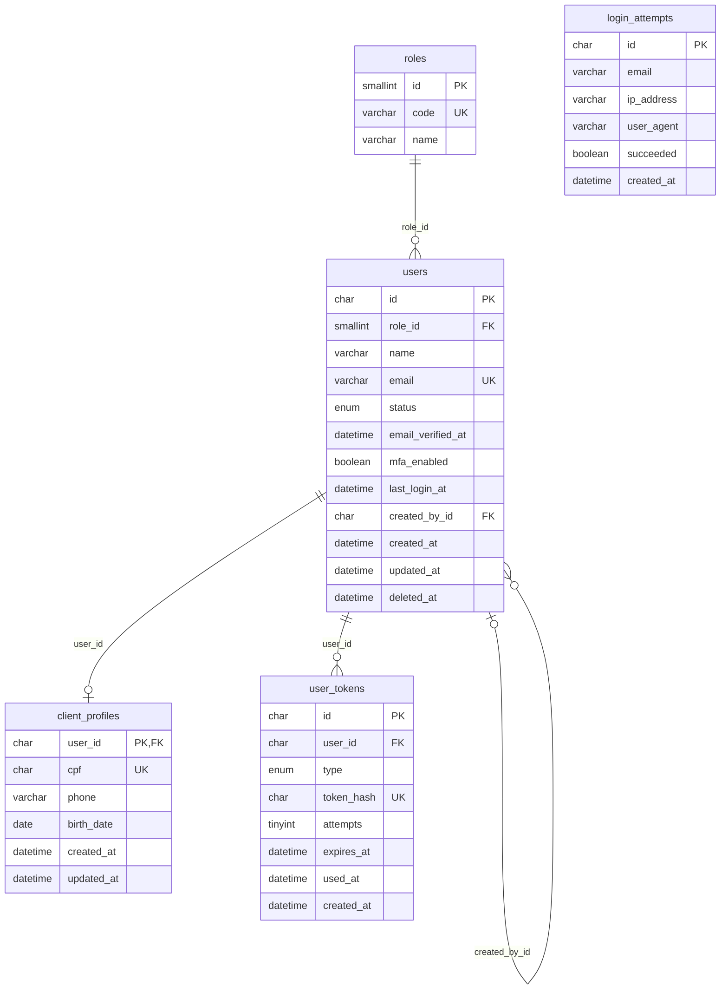

# Banco de dados

**MySQL 9.7 (LTS)** com **TypeORM 1.x**, integrado ao Nest via `@nestjs/typeorm`. O schema muda **somente por migrations**. O `synchronize` fica sempre desligado.

## Ambiente local

O MySQL roda em Docker, pelo [docker-compose.yml](../docker-compose.yml), junto com o SuperTokens (Core e PostgreSQL) e o Mailpit:

```bash
cp .env.example .env   # ajuste se necessário
npm run db:up          # sobe os containers e aguarda ficarem saudáveis
npm run migration:run  # aplica as migrations
npm run seed           # cadastra o SuperAdm e cria os papéis no SuperTokens
npm run start:dev
```

- O container expõe a porta **3307**, para não conflitar com um MySQL instalado localmente na 3306. Para mudar, altere `DB_PORT` no `.env`.
- Na primeira inicialização, o script [docker/mysql/init](../docker/mysql/init/01-create-test-database.sh) cria também o banco de testes `<DB_DATABASE>_test`.
- Os dados ficam no volume `mysql-data`. Para zerar o banco, rode `docker compose down -v`. Isso **apaga todos os dados**, e os scripts de inicialização rodam de novo na próxima subida.

### PostgreSQL do SuperTokens

As credenciais, as sessões e os papéis dos usuários ficam no **SuperTokens Core**, que não suporta MySQL. Por isso, o `npm run db:up` também sobe um **PostgreSQL 18** exclusivo do Core (serviço `supertokens-db`, volume `supertokens-db-data`).

- As tabelas do SuperTokens são criadas e migradas pelo próprio Core. Elas **não** entram nas migrations do TypeORM.
- O PostgreSQL não expõe porta no host: só o Core o acessa, pela rede interna do Docker. A API fala apenas com o Core, em `SUPERTOKENS_CONNECTION_URI`.
- A senha do banco vem da variável `SUPERTOKENS_DB_PASSWORD`, usada só pelo docker-compose.
- O `docker compose down -v` também apaga esse volume, e com ele todas as credenciais e sessões.
- **Os dois bancos andam juntos:** cada linha de `users` tem uma credencial com o mesmo id no SuperTokens. Zerar só um deles deixa usuários órfãos no outro: sem o MySQL, os e-mails ficam presos no Core ("E-mail já cadastrado"), e sem o Core, as contas do MySQL não conseguem mais entrar. Para recomeçar, apague os dois (`docker compose down -v`).

Para inspecionar o banco do Core (somente leitura, as tabelas são dele):

```bash
docker compose exec supertokens-db psql -U supertokens -d supertokens -c '\dt'
```

Como a API usa o Core está no [AUTH.md](AUTH.md).

## Variáveis de ambiente

As variáveis são validadas na inicialização pelo schema Zod em [src/config/env.schema.ts](../src/config/env.schema.ts). Se alguma estiver inválida, a aplicação não sobe e mostra qual variável está errada.

| Variável           | Padrão                  | Descrição                                                    |
| ------------------ | ----------------------- | ------------------------------------------------------------ |
| `NODE_ENV`         | `development`           | `development`, `test` ou `production`                        |
| `PORT`             | `3000`                  | Porta HTTP da aplicação                                      |
| `DB_HOST`          | (obrigatória)           | Host do MySQL                                                |
| `DB_PORT`          | `3306`                  | Porta do MySQL (`3307` no `.env.example`, que é a do Docker) |
| `DB_USERNAME`      | (obrigatória)           | Usuário da aplicação                                         |
| `DB_PASSWORD`      | (obrigatória)           | Senha do usuário                                             |
| `DB_DATABASE`      | (obrigatória)           | Nome do banco                                                |
| `DB_LOGGING`       | `false`                 | Loga as queries SQL (`true`/`false`)                         |
| `DB_ROOT_PASSWORD` | (obrigatória no Docker) | Senha de root, usada apenas pelo docker-compose              |

Esta tabela traz só as variáveis do banco. A lista completa, com as do SuperTokens, do e-mail e do seed, está no [README](../README.md#variáveis-de-ambiente).

Para adicionar uma variável, declare-a no `envSchema` e no `.env.example`. No código, leia os valores pelo `ConfigService<Env, true>` com `{ infer: true }`, para ter tipagem, e não pelo `process.env` direto.

## Entidades

O domínio e a persistência usam classes separadas (ver [ARCHITECTURE.md](ARCHITECTURE.md)):

| Classe              | Onde fica                                                   | Papel                                                                                                                                         |
| ------------------- | ----------------------------------------------------------- | --------------------------------------------------------------------------------------------------------------------------------------------- |
| Entidade de domínio | `modules/<feature>/domain/entities/*.entity.ts`             | Regras de negócio. Estende [`Entity`](../src/shared/domain/entity.ts), que gera o id (UUID) e compara identidade.                             |
| Entidade ORM        | `modules/<feature>/infra/database/entities/*.orm-entity.ts` | Mapeamento da tabela. Estende [`BaseOrmEntity`](../src/shared/infra/database/base.orm-entity.ts), que traz `id`, `created_at` e `updated_at`. |
| Mapper              | `modules/<feature>/infra/database/mappers/*.mapper.ts`      | Converte uma na outra (`toDomain` e `toPersistence`).                                                                                         |

Convenções de mapeamento:

- **Tabelas** no plural e em `snake_case`: `@Entity('reports')`.
- **Colunas** em `snake_case`, com nome explícito: `@Column({ name: 'full_name' })`.
- **Datas** em `datetime(3)` e em UTC. A conexão usa `timezone: 'Z'`.
- **Charset** `utf8mb4`, que aceita acentos e emojis.

As entidades ORM são registradas no módulo da própria feature com `TypeOrmModule.forFeature([ReportOrmEntity])`. O `autoLoadEntities` já as inclui na conexão, então não existe uma lista global de entidades para manter.

Outros cuidados:

- **Nomes de índices e constraints** são explícitos nas entidades (`@Unique('uq_users_email', ...)`, `@Index('idx_users_role_id')`, `foreignKeyConstraintName: 'fk_users_role_id'`). Com os mesmos nomes na migration, o `migration:generate` não propõe diferenças falsas. O padrão é `uq_`, `idx_` e `fk_` + `<tabela>_<colunas>`.
- **`created_at` e `updated_at`** usam `CREATED_AT_COLUMN` e `UPDATED_AT_COLUMN`, exportados de [`base.orm-entity.ts`](../src/shared/infra/database/base.orm-entity.ts). Sem eles, o TypeORM gera `DEFAULT CURRENT_TIMESTAMP(6)`, que o MySQL recusa numa coluna `datetime(3)`. As tabelas que não estendem `BaseOrmEntity` devem reaproveitá-los.
- **Colunas `DATE`** (sem hora) são lidas como string `'YYYY-MM-DD'` (`dateStrings: ['DATE']` na conexão). Como `Date`, o dia mudaria em fusos negativos, como o do Brasil.

## Tabelas



| Tabela            | Conteúdo                                                                                                                                                                                                                                                                                                          |
| ----------------- | ----------------------------------------------------------------------------------------------------------------------------------------------------------------------------------------------------------------------------------------------------------------------------------------------------------------- |
| `roles`           | Papéis de acesso, carregados pela própria migration: `1` = `SUPER_ADMIN`, `2` = `ADMIN`, `3` = `CLIENT`. O `code` é o mesmo nome do papel no SuperTokens                                                                                                                                                          |
| `users`           | Dados comuns a todos os papéis. O `id` é o mesmo do usuário no SuperTokens, e não há coluna de senha. `deleted_at` marca a exclusão lógica                                                                                                                                                                        |
| `client_profiles` | Dados exclusivos do Client (1:1 com `users`, com a PK igual à FK): CPF e telefone só com dígitos, e a data de nascimento                                                                                                                                                                                          |
| `user_tokens`     | Tokens de uso único enviados por e-mail. O `type` diz o uso: `INVITATION` (convite de ADM), `PASSWORD_RESET` (redefinição de senha), `EMAIL_VERIFICATION` (verificação de e-mail) e `LOGIN_CODE` (código da segunda etapa do login, o único que usa o contador de erros `attempts`). Guarda só o SHA-256 do token |
| `login_attempts`  | Uma linha por tentativa de login: o e-mail informado (com conta ou não), o IP, o user agent e o resultado. Tem índices em (`email`, `created_at`), para contar as falhas recentes de um e-mail, e em `created_at`, para apagar as linhas antigas                                                                  |

As FKs de `client_profiles` e `user_tokens` usam `ON DELETE CASCADE`, porque esses registros não existem sem o usuário. As de `users` (`role_id` e `created_by_id`) usam `RESTRICT`. Na prática, os usuários não são apagados fisicamente: a exclusão é lógica.

`login_attempts` não tem FK para `users` de propósito: o bloqueio do login conta as tentativas de qualquer e-mail informado, com conta ou não.

As credenciais e as sessões ficam no PostgreSQL do SuperTokens, criado e mantido pelo próprio Core, fora das nossas migrations. O modelo completo e as regras de negócio estão em [sprints/sprint-2-usuarios.md](sprints/sprint-2-usuarios.md). Os tipos de token e a tabela `login_attempts` vêm do plano de login, em [sprints/sprint-3-login.md](sprints/sprint-3-login.md#3-modelagem-mysql).

### Status do usuário

`users.status` é um `ENUM` com três valores. As transições e o que cada uma faz no SuperTokens estão no [AUTH.md](AUTH.md#ciclo-de-vida-das-contas).

| Status     | Significado                                                               |
| ---------- | ------------------------------------------------------------------------- |
| `PENDING`  | ADM convidado que ainda não definiu a senha. Só existe para o papel ADMIN |
| `ACTIVE`   | Pode fazer login e acessar a API                                          |
| `INACTIVE` | Bloqueado por um ADM ou pelo SuperAdm. Pode ser reativado                 |

### Exclusão lógica e anonimização

A linha de `users` nunca é apagada. Na exclusão (RN11):

- `deleted_at` é preenchido. A coluna é um `@DeleteDateColumn`, então as consultas do TypeORM já ignoram o usuário excluído.
- `email` vira `deleted+<id>@reportaai.invalid`. Como a coluna é `UNIQUE`, é isso que libera o endereço original para um novo cadastro.
- No **ADMIN**, o nome é mantido, para auditoria, e os convites dele em `user_tokens` são apagados.
- No **CLIENT**, o nome vira `Usuário excluído` e a linha de `client_profiles` é apagada, com o CPF, o telefone e a data de nascimento (LGPD). O CPF também fica livre para um novo cadastro.
- No SuperTokens, o usuário é removido, com as credenciais e as sessões.

## Migrations

As migrations ficam em [src/shared/infra/database/migrations](../src/shared/infra/database/migrations), numa única linha do tempo para todo o projeto. A CLI do TypeORM roda sobre o código **compilado** (`dist/`), e por isso os scripts fazem o build antes de executar.

| Comando                                                                     | O que faz                                                       |
| --------------------------------------------------------------------------- | --------------------------------------------------------------- |
| `npm run migration:generate -- src/shared/infra/database/migrations/<Nome>` | Gera uma migration com a diferença entre as entidades e o banco |
| `npm run migration:run`                                                     | Aplica as migrations pendentes                                  |
| `npm run migration:revert`                                                  | Desfaz a última migration aplicada                              |
| `npm run migration:show`                                                    | Lista as migrations e mostra quais já foram aplicadas           |

Regras:

- **Nunca edite uma migration que já foi mergeada.** Para corrigir algo, crie uma nova.
- Revise o SQL gerado antes de commitar. O `migration:generate` pode propor um `DROP` inesperado.
- Implemente o `down` sempre que a reversão for possível.

## Seed do SuperAdm

O SUPER_ADMIN não é criado por nenhum endpoint (RN03): ele é cadastrado pelo seed, com os dados das variáveis `SUPER_ADMIN_NAME`, `SUPER_ADMIN_EMAIL` e `SUPER_ADMIN_PASSWORD` (só o seed as exige).

```bash
npm run migration:run  # o seed precisa da tabela roles
npm run seed
```

Como as migrations, o script faz o build e roda sobre o `dist/` ([src/seed.ts](../src/seed.ts)). Ele:

1. cria os papéis `SUPER_ADMIN`, `ADMIN` e `CLIENT` no UserRoles do SuperTokens, se ainda não existirem;
2. se já existir um SUPER_ADMIN no MySQL, só avisa no log e termina;
3. cria a credencial no SuperTokens, atribui o papel SUPER_ADMIN e grava o `users` com o mesmo id, `ACTIVE` e com `email_verified_at` preenchido.

Se a gravação no MySQL falhar, a credencial criada no SuperTokens é removida, e o seed pode ser rodado de novo. Rodar o seed várias vezes não duplica o SuperAdm.

## Testes de integração

Ficam em `test/`, com o padrão `*.integration-spec.ts`, e rodam contra um MySQL real:

```bash
npm run db:up
npm run test:integration
```

O script carrega o `.env` e, em seguida, o [.env.test](../.env.test), que troca o banco para `reportaai_cm_test`. Como proteção, o teste **aborta se o nome do banco não terminar em `_test`**, para nunca rodar migrations no banco de desenvolvimento.

Os testes e2e (`npm run test:e2e`) usam o mesmo banco e a mesma proteção. Eles apagam todos os usuários do banco de teste ao começar e ao terminar ([TESTING.md](TESTING.md#testes-e2e)).
