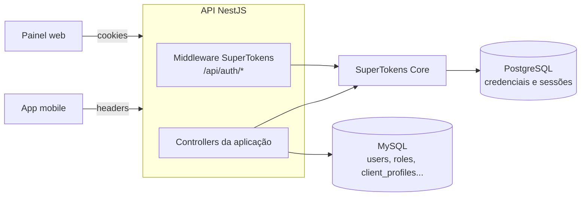
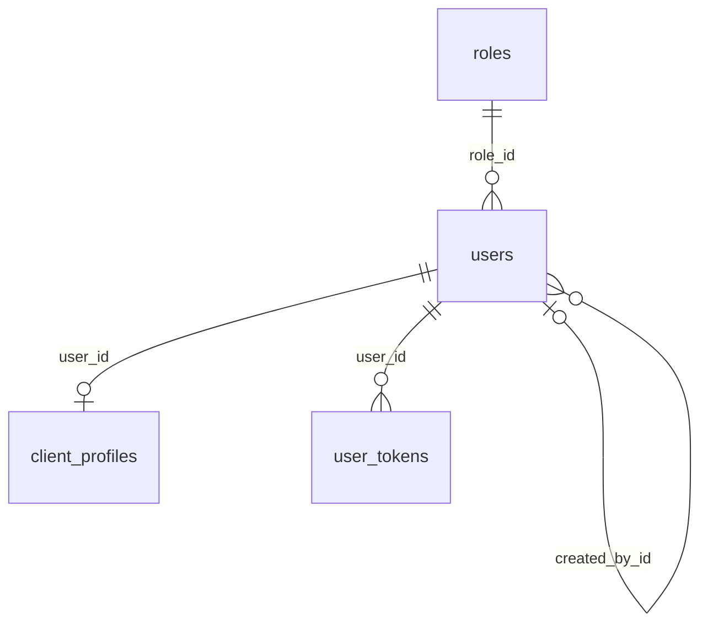
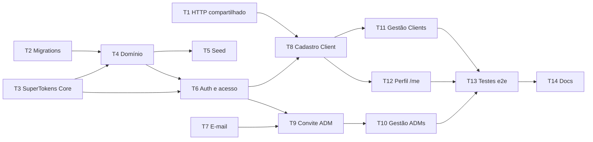

# Sprint 2 (22/09 - 05/10): usuários e autenticação

Plano do backend para o CRUD de usuários com três níveis de acesso (SuperAdm, ADM e Client), com autenticação pelo **SuperTokens** e convite de ADM por e-mail.

## 1. Decisões

| Tema                 | Decisão                                                                                                                                                    |
| -------------------- | ---------------------------------------------------------------------------------------------------------------------------------------------------------- |
| Autenticação         | **SuperTokens** self-hosted, com as receitas EmailPassword, Session e UserRoles, integrado pelo SDK `supertokens-node` (sem o `supertokens-nestjs`).       |
| SuperTokens Core     | Container próprio, com um **PostgreSQL** só para ele (o Core não suporta mais MySQL desde a versão 11.0.0). O MySQL continua com os dados da aplicação.    |
| Rotas de auth        | As rotas nativas do SuperTokens em `/api/auth` (signin, refresh, signout), compatíveis com os SDKs web e React Native.                                     |
| Sessão               | Access token de 15 min e refresh token rotativo de 7 dias, com detecção de roubo (do próprio SuperTokens). Web por cookie, app por header.                 |
| Níveis de acesso     | Tabela `roles` + `users.role_id` no MySQL são a fonte da verdade. O papel é espelhado no UserRoles do SuperTokens, que o coloca no token.                  |
| Dados do Client      | Tabela `client_profiles` (1:1 com `users`): CPF, telefone e data de nascimento.                                                                            |
| Identificador        | E-mail, único no sistema inteiro e usado no login de todos os papéis.                                                                                      |
| Id do usuário        | O id gerado pelo SuperTokens no cadastro é o mesmo `users.id` no MySQL.                                                                                    |
| Criação de ADM       | O SuperAdm convida por e-mail. O convite fica na nossa tabela `user_tokens` (uso único, 48 h), e o aceite define a senha no SuperTokens.                   |
| Criação de SuperAdm  | Só pelo seed (`npm run seed`), com os dados vindos de variáveis de ambiente.                                                                               |
| Exclusão             | `status` (ACTIVE/INACTIVE) para bloquear o acesso + `deleted_at` para exclusão lógica, com anonimização. Na exclusão, o usuário é removido do SuperTokens. |
| ADM x Client         | ADM e SuperAdm listam, consultam, inativam e reativam Clients. Não editam os dados deles.                                                                  |
| E-mail               | Porta `MailSender` + adapter Nodemailer (SMTP). Em dev, o Mailpit roda no docker-compose e captura os e-mails.                                             |
| Hash de senha        | Feito pelo SuperTokens Core, configurado com argon2 (`PASSWORD_HASHING_ALG=ARGON2`).                                                                       |
| MFA                  | Fica fora desta sprint (ver os pontos em aberto: o MFA do SuperTokens é pago).                                                                             |
| Validação de request | Zod (já é dependência do projeto), com um pipe compartilhado.                                                                                              |

## 2. Arquitetura



- O **SuperTokens** guarda as credenciais (e-mail e hash da senha), as sessões e os papéis espelhados.
- O **MySQL** guarda os dados da aplicação e é a fonte da verdade de papel, status e perfil.
- O domínio não importa o SDK. O módulo `users` define uma porta `IdentityProvider` (criar credencial, trocar senha, remover credencial, revogar sessões, atribuir papel), e o adapter `SuperTokensIdentityProvider` fica em `infra/`.

## 3. Modelagem (MySQL)



As tabelas do SuperTokens ficam no PostgreSQL dele e são criadas pelo próprio Core. Não entram nas nossas migrations.

### `roles`

Dados de referência, inseridos pela própria migration (a aplicação não funciona sem eles). Não usa `BaseOrmEntity`: os ids são fixos e não há timestamps.

| Coluna | Tipo                | Restrições | Observação                                      |
| ------ | ------------------- | ---------- | ----------------------------------------------- |
| `id`   | `SMALLINT UNSIGNED` | PK         | 1 = SUPER_ADMIN, 2 = ADMIN, 3 = CLIENT          |
| `code` | `VARCHAR(30)`       | UNIQUE     | Mesmo nome do papel no UserRoles do SuperTokens |
| `name` | `VARCHAR(60)`       | NOT NULL   | Super administrador, Administrador, Cidadão     |

### `users`

Dados comuns a todos os papéis. Estende `BaseOrmEntity`. Não tem senha: as credenciais ficam no SuperTokens.

| Coluna              | Tipo                                  | Restrições                      | Observação                                                                                                     |
| ------------------- | ------------------------------------- | ------------------------------- | -------------------------------------------------------------------------------------------------------------- |
| `id`                | `CHAR(36)`                            | PK                              | Mesmo id do usuário no SuperTokens                                                                             |
| `role_id`           | `SMALLINT UNSIGNED`                   | FK `roles.id`, NOT NULL, índice | Imutável depois da criação                                                                                     |
| `name`              | `VARCHAR(120)`                        | NOT NULL                        |                                                                                                                |
| `email`             | `VARCHAR(254)`                        | UNIQUE, NOT NULL                | Cópia do e-mail do SuperTokens, para listar e buscar sem consultar o Core. Guardado com `trim` e em minúsculas |
| `status`            | `ENUM('PENDING','ACTIVE','INACTIVE')` | NOT NULL                        | PENDING só existe para ADM convidado                                                                           |
| `email_verified_at` | `DATETIME(3)`                         | NULL                            | Preenchido ao aceitar o convite                                                                                |
| `mfa_enabled`       | `BOOLEAN`                             | NOT NULL, default `false`       | Reservado para o MFA                                                                                           |
| `last_login_at`     | `DATETIME(3)`                         | NULL                            | Atualizado no override de sign-in                                                                              |
| `created_by_id`     | `CHAR(36)`                            | FK `users.id`, NULL             | SuperAdm que convidou o ADM. NULL para seed e Client                                                           |
| `created_at`        | `DATETIME(3)`                         | NOT NULL                        |                                                                                                                |
| `updated_at`        | `DATETIME(3)`                         | NOT NULL                        |                                                                                                                |
| `deleted_at`        | `DATETIME(3)`                         | NULL                            | Exclusão lógica (`@DeleteDateColumn`)                                                                          |

> `status` é um atributo atômico de uma máquina de estados definida no código, então um `ENUM` mantém a 3FN. Já o papel é uma entidade do domínio, referenciada pelas regras de permissão, e por isso tem tabela própria.
>
> O e-mail existe nos dois lados (MySQL e SuperTokens). Como ele não pode ser alterado nesta sprint, só é gravado no cadastro e na anonimização. Quando a troca de e-mail existir, as duas cópias precisam ser atualizadas juntas.

### `client_profiles`

Dados exclusivos do Client (1:1). A PK é a própria FK, então não usa `BaseOrmEntity`.

| Coluna       | Tipo          | Restrições        | Observação                                                 |
| ------------ | ------------- | ----------------- | ---------------------------------------------------------- |
| `user_id`    | `CHAR(36)`    | PK, FK `users.id` |                                                            |
| `cpf`        | `CHAR(11)`    | UNIQUE, NOT NULL  | Só dígitos, validado pelos dígitos verificadores. Imutável |
| `phone`      | `VARCHAR(11)` | NOT NULL          | DDD + número, só dígitos. Não é único                      |
| `birth_date` | `DATE`        | NOT NULL          |                                                            |
| `created_at` | `DATETIME(3)` | NOT NULL          |                                                            |
| `updated_at` | `DATETIME(3)` | NOT NULL          |                                                            |

### `user_tokens`

Tokens de uso único enviados por e-mail. Nesta sprint só existe o tipo `INVITATION`.

| Coluna       | Tipo                 | Restrições    | Observação                                      |
| ------------ | -------------------- | ------------- | ----------------------------------------------- |
| `id`         | `CHAR(36)`           | PK            |                                                 |
| `user_id`    | `CHAR(36)`           | FK `users.id` | Índice composto (`user_id`, `type`)             |
| `type`       | `ENUM('INVITATION')` | NOT NULL      | Novos tipos entram por migration                |
| `token_hash` | `CHAR(64)`           | UNIQUE        | SHA-256 do token. O token puro só vai no e-mail |
| `expires_at` | `DATETIME(3)`        | NOT NULL      |                                                 |
| `used_at`    | `DATETIME(3)`        | NULL          |                                                 |
| `created_at` | `DATETIME(3)`        | NOT NULL      |                                                 |

> O convite não usa o reset de senha do SuperTokens porque o tempo de vida do token de reset é uma configuração global do Core, que valeria também para a recuperação de senha no futuro. Além disso, gerar um novo link lá não invalida os anteriores. Com a nossa tabela, o convite tem validade própria e o reenvio invalida os links antigos.

## 4. Regras de negócio

| Código | Regra                                                                                                                                                                                                                                                                                                                                   |
| ------ | --------------------------------------------------------------------------------------------------------------------------------------------------------------------------------------------------------------------------------------------------------------------------------------------------------------------------------------- |
| RN01   | Todo usuário tem exatamente um papel, e o papel não muda depois da criação.                                                                                                                                                                                                                                                             |
| RN02   | O e-mail é único no sistema inteiro, normalizado (`trim` + minúsculas) e é o identificador de login.                                                                                                                                                                                                                                    |
| RN03   | Nenhum endpoint cria, edita, inativa ou exclui um SUPER_ADMIN. Ele só é criado pelo seed.                                                                                                                                                                                                                                               |
| RN04   | Só o SUPER_ADMIN cria, edita, inativa, reativa e exclui ADMINs. Um ADMIN não gerencia outros ADMINs.                                                                                                                                                                                                                                    |
| RN05   | O CLIENT só é criado pelo autocadastro no app e já nasce ACTIVE. O sign-up nativo do SuperTokens fica desativado.                                                                                                                                                                                                                       |
| RN06   | O ADMIN nasce PENDING, com uma senha aleatória e descartada no SuperTokens (ninguém a conhece). O convite vale 48 h e é de uso único. Ao aceitar, o ADMIN define a senha, fica ACTIVE e tem `email_verified_at` preenchido. Reenviar o convite invalida os anteriores, e só é possível enquanto ele estiver PENDING.                    |
| RN07   | O CPF é único, validado pelos dígitos verificadores, guardado só com dígitos e não pode ser alterado.                                                                                                                                                                                                                                   |
| RN08   | A senha tem de 8 a 128 caracteres, com pelo menos uma letra e um número. A política é aplicada no validador do SuperTokens e no aceite do convite. O hash é feito pelo Core e a senha nunca aparece em respostas ou logs.                                                                                                               |
| RN09   | Só usuários ACTIVE e não excluídos fazem login. O override do sign-in consulta o status no MySQL, e o erro é sempre genérico ("Credenciais inválidas"), para não revelar se o e-mail existe.                                                                                                                                            |
| RN10   | Inativar um usuário revoga todas as sessões dele no SuperTokens. O guard de autenticação também confere o status no MySQL a cada requisição, então o bloqueio vale na hora, sem esperar o access token expirar.                                                                                                                         |
| RN11   | A exclusão é lógica (`deleted_at`). O usuário é removido do SuperTokens (credenciais e sessões), e no MySQL o e-mail é trocado por `deleted+<id>@reportaai.invalid`, o que libera o endereço para um novo cadastro. No CLIENT, o nome é anonimizado e o `client_profiles` é removido (LGPD). No ADMIN, o nome é mantido para auditoria. |
| RN12   | ADMIN e SUPER_ADMIN listam, consultam, inativam e reativam CLIENTs, mas não editam os dados deles. Para eles, o CPF aparece mascarado (`***.456.789-**`).                                                                                                                                                                               |
| RN13   | Para trocar a senha, é preciso informar a senha atual. A troca revoga as outras sessões do usuário.                                                                                                                                                                                                                                     |
| RN14   | O refresh token é rotativo, e o reuso de um token já rotacionado revoga a sessão (comportamento nativo do SuperTokens).                                                                                                                                                                                                                 |
| RN15   | O CLIENT pode excluir a própria conta, confirmando com a senha. ADMIN e SUPER_ADMIN não se autoexcluem.                                                                                                                                                                                                                                 |
| RN16   | As rotas nativas do SuperTokens que não fazem parte do escopo ficam desativadas: sign-up, verificação de e-mail existente (evita descobrir quais e-mails têm conta) e reset de senha.                                                                                                                                                   |

### Matriz de permissões

| Ação                                                  | SUPER_ADMIN | ADMIN | CLIENT | Público |
| ----------------------------------------------------- | :---------: | :---: | :----: | :-----: |
| Autocadastro de Client                                |             |       |        |    ✔    |
| Login, refresh e aceite de convite                    |             |       |        |    ✔    |
| Logout, ver e editar o próprio perfil, trocar a senha |      ✔      |   ✔   |   ✔    |         |
| Excluir a própria conta                               |             |       |   ✔    |         |
| Convidar, listar, editar, inativar e excluir ADMs     |      ✔      |       |        |         |
| Listar, consultar, inativar e reativar Clients        |      ✔      |   ✔   |        |         |

## 5. Endpoints

Todos ficam sob `/api`. As rotas da aplicação são autenticadas por padrão (guard global), e as públicas são marcadas com `@Public()`.

**Rotas nativas do SuperTokens** (atendidas pelo middleware, em `/api/auth`):

| Método | Rota                    | Descrição                                                                                       |
| ------ | ----------------------- | ----------------------------------------------------------------------------------------------- |
| `POST` | `/auth/signin`          | Login. Corpo no formato do SuperTokens: `{ formFields: [{ id: 'email' }, { id: 'password' }] }` |
| `POST` | `/auth/session/refresh` | Renova a sessão (os SDKs chamam sozinhos)                                                       |
| `POST` | `/auth/signout`         | Encerra a sessão atual                                                                          |

O web recebe os tokens em cookies httpOnly (com proteção anti-CSRF). O app manda o header `st-auth-mode: header` e recebe os tokens nos headers `st-access-token` e `st-refresh-token`. Os SDKs `supertokens-web-js` e `supertokens-react-native` fazem isso sozinhos.

**Rotas da aplicação:**

| Método   | Rota                     | Acesso             | Descrição                                                             |
| -------- | ------------------------ | ------------------ | --------------------------------------------------------------------- |
| `POST`   | `/invitations/accept`    | Público            | `{ token, password }`: ativa o ADM                                    |
| `POST`   | `/clients`               | Público            | Autocadastro do Client                                                |
| `GET`    | `/clients`               | ADMIN, SUPER_ADMIN | Lista paginada, com filtro por status e busca por nome, e-mail ou CPF |
| `GET`    | `/clients/:id`           | ADMIN, SUPER_ADMIN | Detalhe, com CPF mascarado                                            |
| `PATCH`  | `/clients/:id/status`    | ADMIN, SUPER_ADMIN | `{ status: ACTIVE \| INACTIVE }`                                      |
| `POST`   | `/admins`                | SUPER_ADMIN        | `{ name, email }`: cria o ADM PENDING e envia o convite               |
| `GET`    | `/admins`                | SUPER_ADMIN        | Lista paginada, com filtro por status                                 |
| `GET`    | `/admins/:id`            | SUPER_ADMIN        | Detalhe                                                               |
| `PATCH`  | `/admins/:id`            | SUPER_ADMIN        | `{ name }`                                                            |
| `PATCH`  | `/admins/:id/status`     | SUPER_ADMIN        | `{ status: ACTIVE \| INACTIVE }` (não vale para PENDING)              |
| `POST`   | `/admins/:id/invitation` | SUPER_ADMIN        | Reenvia o convite (só PENDING)                                        |
| `DELETE` | `/admins/:id`            | SUPER_ADMIN        | Exclusão lógica. Também cancela um convite pendente                   |
| `GET`    | `/users/me`              | Autenticado        | Perfil e papel do usuário logado (Client com CPF completo)            |
| `PATCH`  | `/users/me`              | Autenticado        | Nome. O Client também edita telefone e data de nascimento             |
| `PATCH`  | `/users/me/password`     | Autenticado        | `{ currentPassword, newPassword }`                                    |
| `DELETE` | `/users/me`              | CLIENT             | `{ password }`: exclui e anonimiza a conta                            |

Códigos de erro das rotas da aplicação: `400` para validação, `401` para não autenticado ou senha incorreta, `403` para papel sem permissão, `404` para recurso inexistente (também quando um ADMIN tenta acessar um id que não é de Client), `409` para e-mail ou CPF já cadastrado e `422` para regra de negócio violada. As rotas nativas do SuperTokens seguem o formato de resposta dele (`{ status: 'OK' | 'WRONG_CREDENTIALS_ERROR' | ... }`).

## 6. Variáveis de ambiente

**API (`envSchema` e `.env.example`):**

| Variável                      | Exemplo                       | Uso                                             |
| ----------------------------- | ----------------------------- | ----------------------------------------------- |
| `SUPERTOKENS_CONNECTION_URI`  | `http://localhost:3567`       | Endereço do SuperTokens Core                    |
| `SUPERTOKENS_API_KEY`         | (mín. 20 caracteres)          | Chave que a API usa para falar com o Core       |
| `API_DOMAIN`                  | `http://localhost:3000`       | `appInfo.apiDomain` do SuperTokens              |
| `WEB_APP_URL`                 | `http://localhost:5173`       | `appInfo.websiteDomain`, CORS e link do convite |
| `INVITATION_EXPIRES_IN_HOURS` | `48`                          | Validade do convite de ADM                      |
| `SMTP_HOST`                   | `localhost`                   |                                                 |
| `SMTP_PORT`                   | `1025`                        | Porta SMTP do Mailpit                           |
| `SMTP_USER` / `SMTP_PASSWORD` | (vazio em dev)                |                                                 |
| `SMTP_SECURE`                 | `false`                       |                                                 |
| `MAIL_FROM`                   | `ReportaAi Cm <no-reply@...>` |                                                 |
| `SUPER_ADMIN_NAME`            | `Super Admin`                 | Usada só pelo seed                              |
| `SUPER_ADMIN_EMAIL`           | `superadmin@reportaai.local`  | Usada só pelo seed                              |
| `SUPER_ADMIN_PASSWORD`        | (segue a RN08)                | Usada só pelo seed                              |

**SuperTokens Core (no `docker-compose.yml`):**

| Variável                    | Valor                    | Uso                                  |
| --------------------------- | ------------------------ | ------------------------------------ |
| `POSTGRESQL_CONNECTION_URI` | (Postgres do Core)       | Banco do SuperTokens                 |
| `API_KEYS`                  | `${SUPERTOKENS_API_KEY}` | Mesmo valor da API                   |
| `ACCESS_TOKEN_VALIDITY`     | `900`                    | Access token de 15 min (em segundos) |
| `REFRESH_TOKEN_VALIDITY`    | `10080`                  | Refresh token de 7 dias (em minutos) |
| `PASSWORD_HASHING_ALG`      | `ARGON2`                 | Algoritmo do hash de senha           |

## 7. Labels

Crie a label **`Sprint 2 - 22/09 - 05/10`** (as labels `Epic` e `Task` já existem). O epic recebe `Epic` + a label da sprint, e cada task recebe `Task` + a label da sprint.

## 8. Ordem e dependências



T1, T2, T3 e T7 não dependem de nada e podem começar em paralelo.

---

## 9. Issues

### EPIC

**Título:** `[EPIC] Gestão de usuários e autenticação`
**Labels:** `Epic`, `Sprint 2 - 22/09 - 05/10`

```markdown
Cadastro e gestão de usuários com três níveis de acesso, e a autenticação da API com SuperTokens.

- **SuperAdm**: criado pelo seed. Acessa o painel web, vê todos os reports e é o único que gerencia ADMs.
- **ADM**: convidado por e-mail pelo SuperAdm. Acessa o painel web e os reports, e gerencia os Clients (consulta, inativação e reativação). Não cria outros ADMs.
- **Client**: usuário do app mobile. Faz o próprio cadastro e cria reports.

### Escopo

- SuperTokens self-hosted (Core + PostgreSQL próprio) com as receitas EmailPassword, Session e UserRoles
- Modelagem normalizada no MySQL: `roles`, `users`, `client_profiles` e `user_tokens`
- Autorização por papel, com o MySQL como fonte da verdade
- Seed do SuperAdm
- Convite de ADM por e-mail (Nodemailer + Mailpit)
- CRUD de ADMs (SuperAdm), gestão de Clients (painel) e perfil próprio (/users/me)
- Exclusão lógica com anonimização (LGPD)

### Fora do escopo

MFA, recuperação de senha, verificação de e-mail do Client e troca de e-mail.

### Definição de pronto (vale para todas as tasks)

- Testes unitários dos casos de uso e das regras de domínio, com o SuperTokens isolado atrás da porta `IdentityProvider`
- `npm run lint`, `npm run typecheck` e `npm test` passando
- Migrations com `down` implementado
- Documentação atualizada quando a task mudar env, schema ou rotas

### Tasks

- [ ] T1 [CONFIG] Infraestrutura HTTP compartilhada
- [ ] T2 [DB] Modelagem e migrations das tabelas de usuários
- [ ] T3 [CONFIG] SuperTokens Core no ambiente e integração com o NestJS
- [ ] T4 [FEAT] Domínio de usuários
- [ ] T5 [CONFIG] Seed do SuperAdm
- [ ] T6 [FEAT] Autenticação e controle de acesso por papel
- [ ] T7 [CONFIG] Serviço de envio de e-mail
- [ ] T8 [FEAT] Autocadastro de Client
- [ ] T9 [FEAT] Convite de ADM por e-mail
- [ ] T10 [FEAT] Gestão de ADMs pelo SuperAdm
- [ ] T11 [FEAT] Gestão de Clients pelo painel
- [ ] T12 [FEAT] Perfil do usuário autenticado
- [ ] T13 [TEST] Testes e2e dos fluxos de usuário e das permissões
- [ ] T14 [DOCS] Documentar usuários, autenticação e permissões
```

> Depois de criar as tasks, troque cada `T<n>` pelo número da issue (`#15`), para o GitHub linkar automaticamente. Se preferir, adicione as tasks como sub-issues do epic.

---

### T1

**Título:** `[CONFIG] Infraestrutura HTTP compartilhada (validação, erros e paginação)`

```markdown
Criar em `shared/` a base que todos os endpoints da sprint vão usar.

- Criar um `ZodValidationPipe` para validar body, params e query com schemas Zod
- Criar erros de domínio base em `shared/domain` (NotFound, Conflict, BusinessRule, Forbidden)
- Criar um filtro global de exceções que converta os erros de domínio em HTTP (404, 409, 422, 403) com um corpo padronizado (`statusCode`, `error`, `message`, `details`)
- Criar o padrão de paginação: query `page`/`pageSize` (máx. 100) e resposta `{ items, page, pageSize, total }`
- Registrar pipe e filtro no `main.ts`/`app.module.ts`

**Critérios de aceite**

- Um erro de validação retorna 400 com a lista de campos inválidos
- Um erro não mapeado retorna 500 sem vazar stack trace
- O filtro não intercepta os erros do SuperTokens (eles têm tratamento próprio, na T3)
- Testes unitários do pipe e do filtro
```

### T2

**Título:** `[DB] Modelagem e migrations das tabelas de usuários`

```markdown
Criar o schema de usuários no MySQL, normalizado conforme a modelagem da sprint (`docs/sprints/sprint-2-usuarios.md`, seção 3). As credenciais e sessões ficam no SuperTokens e não entram aqui.

- Tabela `roles` (id, code UNIQUE, name), com a carga de SUPER_ADMIN (1), ADMIN (2) e CLIENT (3) na própria migration
- Tabela `users` (FK para `roles`, `email` UNIQUE, `status`, `email_verified_at`, `mfa_enabled`, `created_by_id`, `deleted_at`), sem coluna de senha
- Tabela `client_profiles` (1:1, PK = `user_id`, `cpf` UNIQUE)
- Tabela `user_tokens` (convites, `token_hash` UNIQUE)
- Entidades ORM (`*.orm-entity.ts`) e registro com `TypeOrmModule.forFeature`
- Índices nas FKs
- Diagrama ER em `docs/DATABASE.md`

**Critérios de aceite**

- `migration:run` e `migration:revert` funcionam num banco limpo
- As FKs impedem `role_id` inválido e `client_profiles` sem usuário
- Teste de integração: inserir dois usuários com o mesmo e-mail falha
```

### T3

**Título:** `[CONFIG] SuperTokens Core no ambiente e integração com o NestJS`

```markdown
Subir o SuperTokens Core e ligar o SDK `supertokens-node` na API. O Core não suporta MySQL, então ele usa um PostgreSQL próprio.

- `docker-compose.yml`: serviço `supertokens-db` (PostgreSQL, volume próprio) e serviço `supertokens` (imagem `supertokens-postgresql` com versão fixada), com `API_KEYS`, `ACCESS_TOKEN_VALIDITY=900`, `REFRESH_TOKEN_VALIDITY=10080` e `PASSWORD_HASHING_ALG=ARGON2`
- Garantir que o `npm run db:up` espere o Core ficar saudável (healthcheck em `/hello`)
- Instalar `supertokens-node` (versão exata) e fazer o `supertokens.init` num `AuthModule`, com `apiBasePath: '/api/auth'` e as receitas EmailPassword, Session e UserRoles
- Registrar o middleware do SuperTokens e um filtro de exceção para os erros dele
- Configurar o CORS com `WEB_APP_URL`, `credentials: true` e os headers de `supertokens.getAllCORSHeaders()`
- Variáveis `SUPERTOKENS_CONNECTION_URI`, `SUPERTOKENS_API_KEY`, `API_DOMAIN` e `WEB_APP_URL` no `envSchema` e no `.env.example`
- Adicionar o Postgres e o Core como services no job de testes do CI

**Critérios de aceite**

- Com `npm run db:up`, o Core responde em http://localhost:3567/hello
- A API sobe conectada ao Core, e sem a variável `SUPERTOKENS_API_KEY` ela não inicia
- `POST /api/auth/signin` responde no formato do SuperTokens
```

### T4

**Título:** `[FEAT] Domínio de usuários: entidades, value objects e regras de hierarquia`

```markdown
Modelar o domínio do módulo `users`, sem dependência de framework nem do SuperTokens.

- Value objects `Email` (normalização e formato), `Cpf` (dígitos verificadores e máscara), `Phone` (DDD + número), `BirthDate` (data no passado) e `Password` (política da RN08)
- `Role` com os códigos SUPER_ADMIN, ADMIN e CLIENT
- Entidade `User` com as transições de status (PENDING → ACTIVE, ACTIVE ⇄ INACTIVE), a exclusão lógica e a anonimização (RN11)
- Entidade `ClientProfile`
- Porta `IdentityProvider` (`createCredentials`, `verifyPassword`, `updatePassword`, `deleteCredentials`, `revokeAllSessions`, `assignRole`) e o adapter `SuperTokensIdentityProvider` em `infra/`
- Contratos `UserRepository` e `ClientProfileRepository` e as implementações TypeORM, com mappers
- Erros de domínio: `EmailAlreadyInUseError`, `CpfAlreadyInUseError`, `InvalidStatusTransitionError` etc.

**Critérios de aceite**

- CPF inválido, e-mail inválido e senha fora da política são rejeitados no domínio
- Não é possível inativar ou excluir um SUPER_ADMIN (RN03)
- Nenhum arquivo de `domain/` ou `application/` importa `supertokens-node` (o ESLint barra)
- Cobertura de testes unitários do domínio ≥ 90%
```

### T5

**Título:** `[CONFIG] Seed do SuperAdm`

```markdown
Criar o script que cadastra o SuperAdm a partir de variáveis de ambiente.

- Script `npm run seed`, que roda sobre o `dist/` como as migrations e inicializa o SDK do SuperTokens
- Ler `SUPER_ADMIN_NAME`, `SUPER_ADMIN_EMAIL` e `SUPER_ADMIN_PASSWORD`, validadas com Zod e só exigidas pelo seed
- Criar os três papéis no UserRoles do SuperTokens (idempotente)
- Criar a credencial no SuperTokens, atribuir o papel SUPER_ADMIN e criar o `users` no MySQL com o mesmo id, ACTIVE e com `email_verified_at` preenchido
- Idempotente: se já existir um SUPER_ADMIN, não faz nada e avisa no log
- Adicionar as variáveis ao `.env.example`

**Critérios de aceite**

- Rodar o seed duas vezes cria um único SuperAdm, tanto no MySQL quanto no SuperTokens
- Se a gravação no MySQL falhar, a credencial criada no SuperTokens é removida
- O SuperAdm criado consegue fazer login (validar após a T6)
```

### T6

**Título:** `[FEAT] Autenticação e controle de acesso por papel (SuperTokens)`

```markdown
Ajustar as rotas nativas do SuperTokens às regras do projeto e proteger as rotas da aplicação.

- Override do sign-in: após validar a senha, consultar o usuário no MySQL e recusar quem não estiver ACTIVE ou estiver excluído, sempre com `WRONG_CREDENTIALS_ERROR` (RN09). Atualizar `last_login_at`
- Validador do campo `password` do EmailPassword com a política da RN08
- Desativar as rotas nativas fora do escopo: sign-up, `signup/email/exists` e reset de senha (RN16)
- Guard global que verifica a sessão do SuperTokens, carrega o usuário no MySQL e bloqueia quem não estiver ACTIVE (RN10)
- Decorators `@Public()`, `@Roles(...)` (autoriza pelo papel do MySQL) e `@CurrentUser()`
- Aceitar tokens por cookie (web) e por header (app, `st-auth-mode: header`)
- Deixar o sign-in com espaço para uma segunda etapa (MFA) no futuro

**Critérios de aceite**

- Usuário INACTIVE, PENDING ou excluído não faz login e perde o acesso na requisição seguinte
- `POST /api/auth/signup` e `GET /api/auth/signup/email/exists` retornam 404
- Uma rota sem `@Public()` retorna 401 sem sessão, e 403 quando o papel não é permitido
- `/api/health` continua público
```

### T7

**Título:** `[CONFIG] Serviço de envio de e-mail (Nodemailer + Mailpit)`

```markdown
Criar a infraestrutura de envio de e-mail, compartilhada entre os módulos.

- Porta `MailSender` (`send({ to, subject, html, text })`) e adapter com Nodemailer (SMTP)
- Serviço Mailpit no `docker-compose.yml` (SMTP 1025, interface web 8025)
- Variáveis `SMTP_HOST`, `SMTP_PORT`, `SMTP_USER`, `SMTP_PASSWORD`, `SMTP_SECURE` e `MAIL_FROM` no `envSchema` e no `.env.example`
- Template simples de e-mail (HTML + texto puro)
- Adapter fake para os testes

**Critérios de aceite**

- Com `npm run db:up`, um e-mail enviado aparece em http://localhost:8025
- Falha de envio gera log de erro sem expor credenciais
```

### T8

**Título:** `[FEAT] Autocadastro de Client pelo app`

```markdown
Endpoint público para o cidadão criar a própria conta pelo app. Substitui o sign-up nativo do SuperTokens, que fica desativado.

- `POST /api/clients` com `name`, `email`, `password`, `cpf`, `phone` e `birthDate`
- Validar os dados e verificar CPF e e-mail duplicados antes de criar a credencial
- Criar a credencial no SuperTokens, atribuir o papel CLIENT e, com o id retornado, criar `users` (ACTIVE) e `client_profiles` na mesma transação do MySQL
- Se a transação falhar, remover a credencial do SuperTokens (compensação)
- Retornar 201 com o perfil, sem nenhum dado sensível. O app faz o login em seguida pelo SDK
- Retornar 409 para e-mail ou CPF já cadastrado (RN02, RN07)

**Critérios de aceite**

- Uma falha no MySQL não deixa credencial órfã no SuperTokens
- A senha nunca aparece na resposta nem nos logs
- CPF com máscara (`123.456.789-09`) é aceito e salvo só com dígitos
```

### T9

**Título:** `[FEAT] Convite de ADM por e-mail`

```markdown
Fluxo em que o SuperAdm convida um ADM, e este define a própria senha.

- `POST /api/admins` (SUPER_ADMIN): cria a credencial no SuperTokens com uma senha aleatória descartada, atribui o papel ADMIN, cria o `users` PENDING com `created_by_id`, gera o token (`user_tokens`, tipo INVITATION, validade de `INVITATION_EXPIRES_IN_HOURS`) e envia o e-mail com o link `${WEB_APP_URL}/convite?token=...`
- `POST /api/admins/:id/invitation` (SUPER_ADMIN): reenvia o convite, invalidando os anteriores (só para PENDING)
- `POST /api/invitations/accept` (público): valida o token (existe, não expirou, não foi usado), aplica a política de senha, define a senha no SuperTokens, deixa o ADM ACTIVE, preenche `email_verified_at` e marca `used_at`
- Variável `INVITATION_EXPIRES_IN_HOURS`

**Critérios de aceite**

- O token puro nunca é salvo no banco
- Um ADM PENDING não consegue fazer login (garantido pelo override da T6)
- Um token expirado, usado ou substituído por reenvio retorna 422
- Um ADMIN que chama `POST /api/admins` recebe 403 (RN04)
- Se o envio do e-mail falhar, o ADM continua PENDING e o convite pode ser reenviado
```

### T10

**Título:** `[FEAT] Gestão de ADMs pelo SuperAdm`

```markdown
CRUD dos ADMs, restrito ao SUPER_ADMIN.

- `GET /api/admins`: lista paginada, com filtro por status
- `GET /api/admins/:id`: detalhe
- `PATCH /api/admins/:id`: edita o nome
- `PATCH /api/admins/:id/status`: inativa ou reativa, revogando as sessões no SuperTokens ao inativar (RN10)
- `DELETE /api/admins/:id`: exclusão lógica, removendo o usuário do SuperTokens e anonimizando o e-mail (RN11). Também serve para cancelar um convite pendente

**Critérios de aceite**

- Os ids de SUPER_ADMIN ou CLIENT retornam 404 nessas rotas
- Um ADM inativado perde o acesso imediatamente
- Depois de excluído, o e-mail pode ser usado em um novo convite
```

### T11

**Título:** `[FEAT] Gestão de Clients pelo painel web`

```markdown
Consulta e bloqueio de Clients pelo painel, para ADMIN e SUPER_ADMIN.

- `GET /api/clients`: lista paginada, com filtro por status e busca por nome, e-mail ou CPF (busca exata)
- `GET /api/clients/:id`: detalhe com CPF mascarado (RN12)
- `PATCH /api/clients/:id/status`: inativa ou reativa, revogando as sessões no SuperTokens ao inativar

**Critérios de aceite**

- Um CLIENT que chama essas rotas recebe 403
- O CPF nunca aparece completo nas respostas dessas rotas
- Os Clients excluídos não aparecem na listagem
```

### T12

**Título:** `[FEAT] Perfil do usuário autenticado (/users/me)`

```markdown
Rotas para o usuário logado ver e manter os próprios dados.

- `GET /api/users/me`: dados do usuário e o papel (o Client recebe o perfil completo, com CPF). É por aqui que os fronts descobrem o papel depois do login
- `PATCH /api/users/me`: edita o nome (todos) e o telefone e a data de nascimento (Client). E-mail e CPF não mudam
- `PATCH /api/users/me/password`: confere a senha atual no SuperTokens, grava a nova com a política da RN08 e revoga as outras sessões (RN13)
- `DELETE /api/users/me` (só CLIENT): confirma com a senha, remove o usuário do SuperTokens, faz a exclusão lógica, anonimiza os dados e remove o `client_profiles` (RN11, RN15)

**Critérios de aceite**

- Uma senha atual incorreta retorna 401
- Depois da autoexclusão, o login falha e o e-mail e o CPF podem ser cadastrados de novo
- ADMIN e SUPER_ADMIN recebem 403 no `DELETE /api/users/me`
```

### T13

**Título:** `[TEST] Testes e2e dos fluxos de usuário e da matriz de permissões`

```markdown
Configurar os testes e2e e cobrir os fluxos principais contra o MySQL de teste e o SuperTokens Core.

- Configuração do Jest para `test/*.e2e-spec.ts` (supertest), reaproveitando a proteção do banco `_test`
- Login nos testes pelo modo header (`st-auth-mode: header`)
- Fluxo do Client: cadastro → signin → /me → refresh → signout
- Fluxo do ADM: seed do SuperAdm → convite → aceite (com o `MailSender` fake) → signin
- Inativação: o usuário inativado perde o acesso na requisição seguinte
- Matriz de permissões: cada rota protegida chamada com cada papel (200/403) e sem sessão (401)
- Rodar os e2e no CI

**Critérios de aceite**

- `npm run test:e2e` passa localmente e no GitHub Actions
- Cada linha da matriz de permissões tem ao menos um teste
```

### T14

**Título:** `[DOCS] Documentar usuários, autenticação e permissões`

```markdown
Atualizar a documentação com o que foi entregue na sprint.

- `docs/AUTH.md`: como o SuperTokens está integrado (Core, overrides, cookie x header), a matriz de permissões e como proteger uma rota nova (`@Public`, `@Roles`)
- Guia rápido para os times web e mobile: quais SDKs usar (`supertokens-web-js`, `supertokens-react-native`) e como fazer login
- `docs/DATABASE.md`: diagrama ER das tabelas de usuários, o PostgreSQL do SuperTokens e o `npm run seed`
- `README.md`: novas variáveis de ambiente, os novos serviços do docker-compose (Core, Postgres, Mailpit) e o comando de seed
- Coleção de requisições (Insomnia/Postman ou arquivo `.http`) com todas as rotas da sprint

**Critérios de aceite**

- Uma pessoa nova consegue subir o projeto, rodar o seed e fazer login seguindo só o README
```

---

## 10. Pontos em aberto

- **MFA é pago no SuperTokens:** a receita de MFA custa US$ 0,01 por usuário ativo por mês, com mínimo de US$ 100/mês, também no self-hosted. Quando o MFA entrar, a alternativa gratuita é implementar a segunda etapa por conta própria, com um código por e-mail (reaproveitando `user_tokens`) e uma claim de sessão customizada.
- **Idade mínima do Client:** a data de nascimento é coletada, mas ainda não há regra de idade mínima. Pela LGPD, o cadastro de menores de 12 anos exige consentimento dos responsáveis.
- **Telefone único?** Nesta proposta, o telefone não é único (pessoas da mesma família podem compartilhar um número).
- **Consentimento LGPD:** vale registrar o aceite dos termos de uso e da política de privacidade no cadastro do Client (ex.: `terms_accepted_at`).
- **Validade do refresh token:** 7 dias obriga o cidadão a logar de novo toda semana sem uso. Como a validade é uma configuração global do Core, vale o mesmo para web e app. 30 dias pode ser um meio-termo melhor.
- **Deploy:** em produção, o SuperTokens Core e o PostgreSQL dele precisam de hospedagem e backup, além do MySQL.
