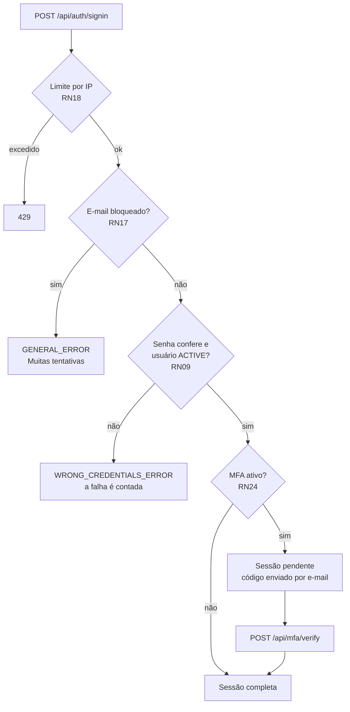
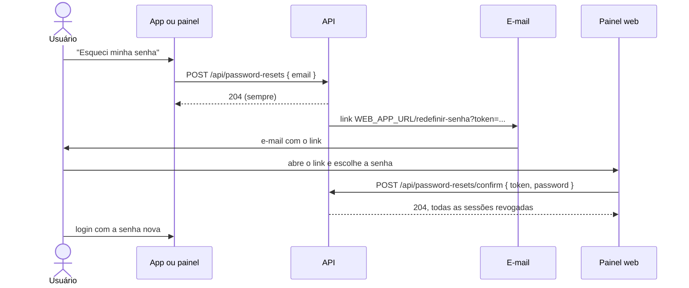
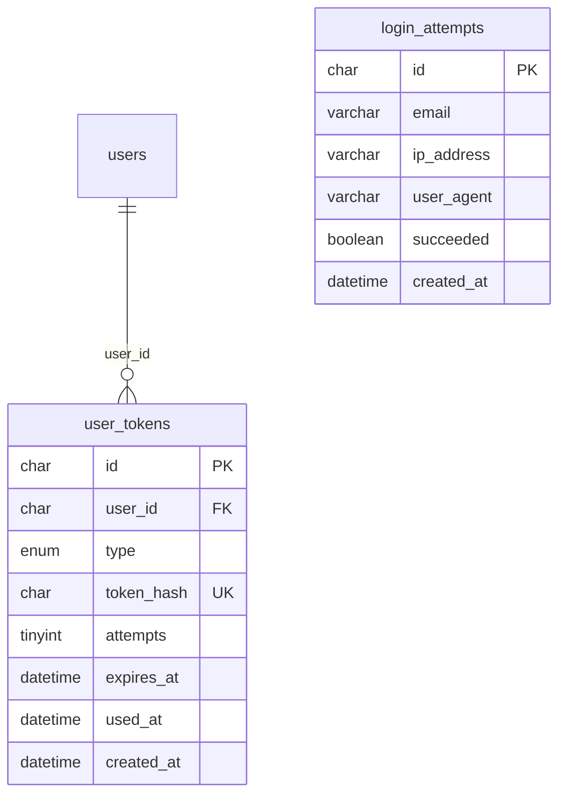
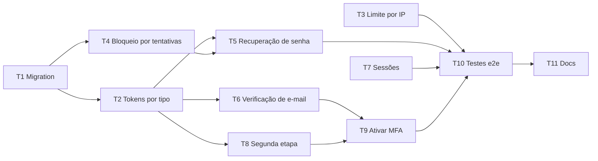

# Sprint 3 (06/10 - 19/10): login e segurança de acesso

Plano do backend para completar o login. A sprint 2 entregou o caminho principal: signin, refresh e signout pelo **SuperTokens**, com o bloqueio por status e a autorização por papel. Faltam os caminhos em volta dele: recuperar a senha, verificar o e-mail, proteger o login contra força bruta, gerenciar as sessões abertas e a segunda etapa do login (MFA).

Este plano continua o da [sprint 2](sprint-2-usuarios.md). As decisões e as regras RN01 a RN16 seguem valendo, e as regras novas continuam a numeração (RN17 a RN25).

## 1. Decisões

| Tema                    | Decisão                                                                                                                                                                                                                                                         |
| ----------------------- | --------------------------------------------------------------------------------------------------------------------------------------------------------------------------------------------------------------------------------------------------------------- |
| Base                    | A mesma da sprint 2: SuperTokens com EmailPassword, Session e UserRoles, e o MySQL como fonte da verdade. Nenhuma receita nova do SuperTokens e nenhum serviço novo no docker-compose.                                                                          |
| Recuperação de senha    | Rotas próprias, com o token em `user_tokens`, como o convite. O reset nativo do SuperTokens continua desativado (RN16): lá, um link novo não invalida os anteriores, e as regras desta sprint (só conta ACTIVE, revogar sessões) teriam de entrar por override. |
| Verificação de e-mail   | Rotas próprias, com `user_tokens`. A receita EmailVerification do SuperTokens não é usada: o estado fica em `users.email_verified_at`, que já existe e já é preenchido no aceite do convite e no seed.                                                          |
| Links dos e-mails       | Apontam sempre para o painel web (`/redefinir-senha` e `/verificar-email`), para os três papéis. O Client abre o link no navegador do celular e volta para o app.                                                                                               |
| Força bruta             | Duas barreiras, feitas na API: bloqueio temporário por e-mail (5 falhas em 15 minutos) e limite de requisições por IP nas rotas públicas.                                                                                                                       |
| Contagem das tentativas | Tabela `login_attempts` no MySQL. Funciona com mais de uma instância da API e deixa as tentativas registradas. A contagem é pelo e-mail informado, com conta ou não, para o bloqueio não revelar quais e-mails existem.                                         |
| Limite por IP           | Middleware com contagem em memória, registrado antes do middleware do SuperTokens. Um guard do Nest não serve: as rotas de `/api/auth` são respondidas pelo middleware, antes dos guards.                                                                       |
| Sessões                 | Listagem e encerramento pelas funções da receita Session. O IP e o user agent do login ficam nos dados da sessão, no Core (`sessionDataInDatabase`).                                                                                                            |
| MFA                     | Segunda etapa própria, com código por e-mail e uma claim de sessão customizada. A receita de MFA do SuperTokens é paga (ponto em aberto da sprint 2). É opcional e por usuário, em `users.mfa_enabled`, que já existe.                                          |
| Código da segunda etapa | 6 dígitos, guardado em `user_tokens` com um contador de tentativas. Vale 10 minutos e aceita 5 erros.                                                                                                                                                           |
| Respostas sem pista     | O pedido de recuperação de senha responde sempre 204, e o bloqueio por tentativas responde igual para e-mail com ou sem conta. Vale o mesmo princípio da RN09.                                                                                                  |
| Demais padrões          | Os da sprint 2: validação com Zod, e-mail pela porta `MailSender`, SuperTokens atrás da porta `IdentityProvider` e os fakes nos testes.                                                                                                                         |

## 2. Fluxos

O que muda na integração com o SuperTokens:

- O **`signInPOST`** (API) ganha um override, para conferir o bloqueio antes da senha e registrar a tentativa depois. O override da função `signIn`, da sprint 2, continua decidindo quem pode entrar (RN09).
- O **`createNewSession`** (receita Session) ganha um override, para guardar o IP e o user agent do login e gravar a claim da segunda etapa.
- O **`AuthGuard`** passa a conferir a claim: a sessão pendente só acessa as rotas da segunda etapa.
- O **limite por IP** entra no `configureApp`, antes do middleware do SuperTokens, como o CORS.

### Login



### Recuperação de senha



A verificação de e-mail segue o mesmo desenho: o link `WEB_APP_URL/verificar-email?token=...` abre uma página do painel, que chama o `POST /api/email-verifications/confirm`.

## 3. Modelagem (MySQL)

A tabela `users` não muda: `email_verified_at`, `mfa_enabled` e `last_login_at` existem desde a sprint 2 e passam a ser usados.



### `user_tokens` (alterada)

| Coluna     | Tipo                                                                    | Restrições          | Observação                                               |
| ---------- | ----------------------------------------------------------------------- | ------------------- | -------------------------------------------------------- |
| `type`     | `ENUM('INVITATION','PASSWORD_RESET','EMAIL_VERIFICATION','LOGIN_CODE')` | NOT NULL            | Três tipos novos                                         |
| `attempts` | `TINYINT UNSIGNED`                                                      | NOT NULL, default 0 | Coluna nova: erros na conferência. Só o `LOGIN_CODE` usa |

Os quatro tipos de token:

| Tipo                 | Formato             | Validade (padrão) | Como é localizado        |
| -------------------- | ------------------- | ----------------- | ------------------------ |
| `INVITATION`         | Link, 256 bits      | 48 horas          | Pelo hash (`token_hash`) |
| `PASSWORD_RESET`     | Link, 256 bits      | 60 minutos        | Pelo hash                |
| `EMAIL_VERIFICATION` | Link, 256 bits      | 24 horas          | Pelo hash                |
| `LOGIN_CODE`         | Código de 6 dígitos | 10 minutos        | Pelo usuário e pelo tipo |

> Um código de 6 dígitos tem só um milhão de valores, então dois usuários podem receber o mesmo código ao mesmo tempo. Como `token_hash` é UNIQUE, o hash do código é calculado junto com o id do usuário. Pelo mesmo motivo, o código vale pouco tempo e tem limite de tentativas.

### `login_attempts` (nova)

Uma linha por tentativa de login. Não usa `BaseOrmEntity`: o registro não é alterado, então não tem `updated_at`.

| Coluna       | Tipo           | Restrições | Observação                                                            |
| ------------ | -------------- | ---------- | --------------------------------------------------------------------- |
| `id`         | `CHAR(36)`     | PK         |                                                                       |
| `email`      | `VARCHAR(254)` | NOT NULL   | E-mail informado, com `trim` e em minúsculas. Pode não ter conta      |
| `ip_address` | `VARCHAR(45)`  | NULL       | Cabe um IPv6                                                          |
| `user_agent` | `VARCHAR(255)` | NULL       | Cortado em 255 caracteres                                             |
| `succeeded`  | `BOOLEAN`      | NOT NULL   |                                                                       |
| `created_at` | `DATETIME(3)`  | NOT NULL   | Índices em (`email`, `created_at`) e em `created_at` (para a limpeza) |

> A tabela não tem FK para `users` de propósito: o bloqueio conta as tentativas de qualquer e-mail, com conta ou não. Como ela guarda dado pessoal (e-mail e IP), as linhas têm prazo de retenção (RN19).

### Dados no SuperTokens

Nada muda nas tabelas do Core. Dois dados novos passam a ser gravados por sessão:

- `sessionDataInDatabase`: o IP e o user agent do login, para a listagem de sessões.
- Claim `mfa-verified` no access token: `true` quando a segunda etapa foi concluída ou dispensada (usuário sem MFA), e `false` enquanto a sessão está pendente.

## 4. Regras de negócio

| Código | Regra                                                                                                                                                                                                                                                                                                                                                                                             |
| ------ | ------------------------------------------------------------------------------------------------------------------------------------------------------------------------------------------------------------------------------------------------------------------------------------------------------------------------------------------------------------------------------------------------- |
| RN17   | Com 5 falhas de login para o mesmo e-mail nos últimos 15 minutos, contadas desde o último login com sucesso, o login desse e-mail fica bloqueado até uma das falhas sair da janela. Durante o bloqueio, nem a senha correta entra, e as tentativas recusadas não entram na conta. A contagem é pelo e-mail informado, e a resposta é a mesma para e-mail com ou sem conta.                        |
| RN18   | As rotas públicas que recebem credenciais ou disparam e-mail aceitam 20 requisições por minuto por IP, em cada rota. Acima disso, a resposta é 429, com o header `Retry-After`.                                                                                                                                                                                                                   |
| RN19   | Toda tentativa de login com um e-mail válido é registrada, com e-mail, IP, user agent e resultado. A senha nunca é registrada. As linhas são apagadas depois de 30 dias, e as do e-mail de uma conta excluída são apagadas junto com ela (RN11).                                                                                                                                                  |
| RN20   | O pedido de recuperação de senha responde sempre 204, exista ou não a conta, e não espera o envio do e-mail. Só a conta ACTIVE e não excluída recebe o link, que vale 60 minutos e é de uso único. Um pedido novo invalida os links anteriores, e a mesma conta recebe no máximo um e-mail por minuto.                                                                                            |
| RN21   | A senha nova segue a RN08. A redefinição revoga todas as sessões do usuário, zera o bloqueio por tentativas do e-mail e preenche o `email_verified_at`, se estiver vazio (o link prova a posse do e-mail). O usuário recebe um e-mail avisando da troca, e o mesmo aviso passa a ser enviado na troca de senha pelo perfil (RN13).                                                                |
| RN22   | O CLIENT nasce com o e-mail não verificado e recebe o link de verificação no cadastro. O link vale 24 horas e é de uso único. O reenvio invalida os anteriores e só existe para quem ainda não verificou. O login não depende da verificação. ADMIN e SUPER_ADMIN já nascem verificados (RN06 e seed).                                                                                            |
| RN23   | O usuário lista as próprias sessões abertas (data do login, IP, user agent e qual é a atual) e encerra qualquer uma delas, ou todas as outras de uma vez. Ninguém vê nem encerra a sessão de outro usuário por essas rotas.                                                                                                                                                                       |
| RN24   | A verificação em duas etapas é opcional e vale para qualquer papel. Ativar exige o e-mail verificado e a senha atual, e revoga as outras sessões. Desativar exige a senha atual.                                                                                                                                                                                                                  |
| RN25   | Com a verificação em duas etapas ativa, o login por senha abre uma sessão pendente, que só acessa as rotas da segunda etapa, o refresh e o signout. O código tem 6 dígitos, vai por e-mail, vale 10 minutos e é de uso único. Cinco erros invalidam o código. O reenvio invalida o código anterior e respeita o intervalo de 1 minuto. O `last_login_at` só é gravado quando o login é concluído. |

### Matriz de permissões (rotas novas)

| Ação                                            | SUPER_ADMIN | ADMIN | CLIENT | Público |
| ----------------------------------------------- | :---------: | :---: | :----: | :-----: |
| Pedir e confirmar a redefinição de senha        |             |       |        |    ✔    |
| Confirmar a verificação de e-mail               |             |       |        |    ✔    |
| Reenviar a verificação do próprio e-mail        |      ✔      |   ✔   |   ✔    |         |
| Listar e encerrar as próprias sessões           |      ✔      |   ✔   |   ✔    |         |
| Ativar e desativar a verificação em duas etapas |      ✔      |   ✔   |   ✔    |         |
| Receber e conferir o código da segunda etapa¹   |      ✔      |   ✔   |   ✔    |         |

¹ Com a sessão pendente: a senha já foi conferida, e o código ainda não. As outras rotas autenticadas exigem a sessão completa.

## 5. Endpoints

Todos ficam sob `/api`. As rotas novas são da aplicação: nenhuma rota nativa do SuperTokens é reativada.

**Rotas novas:**

| Método   | Rota                           | Acesso          | Descrição                                                               |
| -------- | ------------------------------ | --------------- | ----------------------------------------------------------------------- |
| `POST`   | `/password-resets`             | Público         | `{ email }`: envia o link de redefinição. Responde sempre 204           |
| `POST`   | `/password-resets/confirm`     | Público         | `{ token, password }`: grava a senha nova e revoga as sessões           |
| `POST`   | `/email-verifications/confirm` | Público         | `{ token }`: marca o e-mail como verificado                             |
| `POST`   | `/users/me/email-verification` | Autenticado     | Reenvia o link de verificação (só para quem ainda não verificou)        |
| `GET`    | `/users/me/sessions`           | Autenticado     | Sessões abertas do usuário, com a atual marcada                         |
| `DELETE` | `/users/me/sessions/:id`       | Autenticado     | Encerra uma sessão do próprio usuário                                   |
| `DELETE` | `/users/me/sessions`           | Autenticado     | Encerra todas as sessões, menos a atual                                 |
| `PATCH`  | `/users/me/mfa`                | Autenticado     | `{ enabled, password }`: ativa ou desativa a verificação em duas etapas |
| `POST`   | `/mfa/verify`                  | Sessão pendente | `{ code }`: conclui o login                                             |
| `POST`   | `/mfa/code`                    | Sessão pendente | Envia um código novo e invalida o anterior                              |

**Rotas que mudam:**

| Método  | Rota                 | O que muda                                                                                                             |
| ------- | -------------------- | ---------------------------------------------------------------------------------------------------------------------- |
| `POST`  | `/auth/signin`       | Pode responder `{ status: 'GENERAL_ERROR', message }` (bloqueio por tentativas) e 429 (limite por IP)                  |
| `POST`  | `/clients`           | Passa a enviar o e-mail de verificação. A resposta não muda. Também entra no limite por IP, como `/invitations/accept` |
| `GET`   | `/users/me`          | Ganha o campo `mfaEnabled`                                                                                             |
| `PATCH` | `/users/me/password` | Passa a enviar o e-mail de aviso da troca                                                                              |

Códigos de erro novos: `429` para o limite por IP e `403` no formato do SuperTokens (`{ "message": "invalid claim", "claimValidationErrors": [...] }`) para a sessão pendente fora das rotas da segunda etapa. O token de link inválido, expirado ou já usado responde `422`, como no convite, e o código da segunda etapa errado ou vencido também. Nenhum desses casos usa `401`: os SDKs de front tratam o 401 como sessão expirada.

## 6. Variáveis de ambiente

**API (`envSchema` e `.env.example`).** Todas têm valor padrão:

| Variável                              | Padrão | Uso                                                                                    |
| ------------------------------------- | ------ | -------------------------------------------------------------------------------------- |
| `PASSWORD_RESET_EXPIRES_IN_MINUTES`   | `60`   | Validade do link de redefinição de senha                                               |
| `EMAIL_VERIFICATION_EXPIRES_IN_HOURS` | `24`   | Validade do link de verificação de e-mail                                              |
| `MFA_CODE_EXPIRES_IN_MINUTES`         | `10`   | Validade do código da segunda etapa                                                    |
| `LOGIN_MAX_FAILED_ATTEMPTS`           | `5`    | Falhas de login por e-mail que causam o bloqueio                                       |
| `LOGIN_LOCK_WINDOW_MINUTES`           | `15`   | Janela em que as falhas são contadas                                                   |
| `RATE_LIMIT_MAX_REQUESTS`             | `20`   | Requisições por IP em cada rota limitada, por janela                                   |
| `RATE_LIMIT_WINDOW_SECONDS`           | `60`   | Janela do limite por IP                                                                |
| `TRUST_PROXY`                         | `0`    | Quantidade de proxies reversos na frente da API. Define de onde o IP do cliente é lido |

O `.env.test` recebe um `RATE_LIMIT_MAX_REQUESTS` alto, para o limite não interferir nos outros testes.

**SuperTokens Core:** nenhuma variável muda.

## 7. Labels

Crie a label **`Sprint 3 - 06/10 - 19/10`** (as labels `Epic` e `Task` já existem). O epic recebe `Epic` + a label da sprint, e cada task recebe `Task` + a label da sprint.

## 8. Ordem e dependências



T1, T3 e T7 não dependem de nada e podem começar em paralelo.

A T8 e a T9 (MFA) formam um bloco à parte, que nenhuma outra task usa. Se a sprint apertar, é o bloco que pode passar para a seguinte sem travar o resto.

---

## 9. Issues

### EPIC

**Título:** `[EPIC] Login e segurança de acesso`
**Labels:** `Epic`, `Sprint 3 - 06/10 - 19/10`

```markdown
Completar o login da API. A sprint 2 entregou o caminho principal (signin, refresh e signout pelo SuperTokens). Esta sprint entrega o que falta em volta dele, para os três papéis:

- **Recuperar o acesso**: o usuário que esqueceu a senha recebe um link por e-mail e define uma nova, sem depender de ninguém.
- **Confirmar a identidade**: o Client confirma que o e-mail do cadastro é dele, e qualquer usuário pode ativar a verificação em duas etapas, com um código por e-mail.
- **Proteger a conta**: o login bloqueia quem erra a senha várias vezes, as rotas públicas têm limite por IP, e o usuário vê e encerra as sessões abertas em outros aparelhos.

### Escopo

- Recuperação de senha por e-mail, com rotas próprias e `user_tokens` (o reset nativo do SuperTokens continua desativado)
- Verificação de e-mail do Client
- Bloqueio temporário do login por tentativas com falha e registro das tentativas (`login_attempts`)
- Limite de requisições por IP nas rotas públicas
- Listagem e encerramento das sessões do próprio usuário
- Verificação em duas etapas opcional (MFA), com código por e-mail e claim de sessão customizada
- Avisos por e-mail na troca e na redefinição de senha

### Fora do escopo

Troca de e-mail, MFA por aplicativo autenticador (TOTP), MFA obrigatório por papel, "lembrar este aparelho", login social, deep link do app para os links de e-mail e as restrições para quem não verificou o e-mail (entram com os reports).

### Definição de pronto (vale para todas as tasks)

- Testes unitários dos casos de uso e das regras de domínio, com o SuperTokens isolado atrás da porta `IdentityProvider`
- `npm run lint`, `npm run typecheck` e `npm test` passando
- Migrations com `down` implementado
- Rota protegida nova incluída na matriz do `permissions.e2e-spec.ts`
- Documentação atualizada quando a task mudar env, schema ou rotas

### Tasks

- [ ] T1 [DB] Migration dos novos tipos de token e da tabela de tentativas de login
- [ ] T2 [FEAT] Tokens de uso único por tipo
- [ ] T3 [CONFIG] Limite de requisições por IP nas rotas públicas
- [ ] T4 [FEAT] Bloqueio temporário do login por tentativas
- [ ] T5 [FEAT] Recuperação de senha por e-mail
- [ ] T6 [FEAT] Verificação de e-mail do Client
- [ ] T7 [FEAT] Sessões ativas: listar e encerrar
- [ ] T8 [FEAT] Segunda etapa do login por código (MFA)
- [ ] T9 [FEAT] Ativar e desativar a verificação em duas etapas
- [ ] T10 [TEST] Testes e2e dos fluxos de login
- [ ] T11 [DOCS] Documentar login, recuperação de acesso e MFA
```

> Depois de criar as tasks, troque cada `T<n>` pelo número da issue (`#45`), para o GitHub linkar automaticamente. Se preferir, adicione as tasks como sub-issues do epic, como no epic da sprint 2 (#15).

---

### T1

**Título:** `[DB] Migration dos novos tipos de token e da tabela de tentativas de login`

```markdown
Ajustar o schema do MySQL para os fluxos de login da sprint (`docs/sprints/sprint-3-login.md`, seção 3), em uma migration só. A tabela `users` não muda.

- `user_tokens.type`: incluir `PASSWORD_RESET`, `EMAIL_VERIFICATION` e `LOGIN_CODE` no ENUM
- `user_tokens.attempts` (`TINYINT UNSIGNED`, default 0): erros na conferência do código da segunda etapa
- Tabela `login_attempts` (`id`, `email`, `ip_address`, `user_agent`, `succeeded`, `created_at`), com índices em (`email`, `created_at`) e em `created_at`. Sem FK para `users`: o e-mail informado pode não ter conta
- No `down`, apagar os tokens dos tipos novos antes de reduzir o ENUM
- Entidades ORM: atualizar a `UserTokenOrmEntity`, criar a `LoginAttemptOrmEntity` e registrar com `TypeOrmModule.forFeature`
- Atualizar o diagrama ER e a tabela de `docs/DATABASE.md`

**Critérios de aceite**

- `migration:run` e `migration:revert` funcionam num banco limpo e num banco com convite pendente (o token `INVITATION` continua válido)
- Depois da migration, o `migration:generate` não propõe diferenças
- Teste de integração: gravar e ler um token de cada tipo novo e uma tentativa de login
```

### T2

**Título:** `[FEAT] Tokens de uso único por tipo: links, códigos e e-mails compartilhados`

```markdown
Preparar o domínio de `user_tokens`, hoje feito só para o convite, para os três usos novos da sprint. Não cria rota: é a base da T5, da T6 e da T8.

- `UserTokenType` com `PASSWORD_RESET`, `EMAIL_VERIFICATION` e `LOGIN_CODE`
- `UserToken.issue` com a validade em minutos (o convite continua configurado em horas, por `INVITATION_EXPIRES_IN_HOURS`)
- Token em formato de código: 6 dígitos gerados com `crypto.randomInt`, com o hash calculado junto com o id do usuário (o `token_hash` é UNIQUE, e dois usuários podem receber o mesmo código) e um contador de erros que invalida o código no 5º
- `UserTokenRepository`: buscar o token vigente por usuário e tipo (o código não é localizado pelo hash) e gravar o contador de erros
- Extrair do `AdminInvitationService` o que é comum a todo e-mail com link: montar a URL `${WEB_APP_URL}<página>?token=...` e tratar a falha de envio (`MailDeliveryError`). O convite passa a usar a parte comum, sem mudar de comportamento
- `User`: `verifyEmail()` (preenche o `email_verified_at` uma única vez), `enableMfa()` e `disableMfa()`
- Atualizar os fakes do `in-memory-users.ts` com as operações novas do repositório

**Critérios de aceite**

- Os testes do convite (unitários, de integração e e2e) continuam passando
- Depois de 5 erros, o código deixa de ser aceito, mesmo que a tentativa seguinte esteja certa
- O token de um tipo não é aceito no fluxo de outro (ex.: o token de convite na redefinição de senha)
- A cobertura de testes do domínio de `users` continua ≥ 90%
```

### T3

**Título:** `[CONFIG] Limite de requisições por IP nas rotas públicas`

```markdown
Limitar as requisições por IP nas rotas públicas que recebem credenciais ou disparam e-mail (RN18).

- Middleware de limite por IP (ex.: `express-rate-limit`, com a versão exata), registrado no `configureApp`, antes do middleware do SuperTokens. Um guard do Nest não serve: as rotas de `/api/auth` são respondidas pelo middleware, antes dos guards
- Rotas limitadas: `POST /api/auth/signin`, `POST /api/clients` e `POST /api/invitations/accept`. A lista fica em um lugar só, e as rotas públicas da T5 e da T6 entram nela
- O limite é contado por IP e por rota
- Resposta 429 no formato de erro da aplicação (`statusCode`, `error`, `message`), com o header `Retry-After`
- Variáveis `RATE_LIMIT_MAX_REQUESTS` (20) e `RATE_LIMIT_WINDOW_SECONDS` (60) no `envSchema` e no `.env.example`. No `.env.test`, um limite alto, para não interferir nos outros testes
- Variável `TRUST_PROXY` (quantidade de proxies na frente da API, 0 em dev), aplicada ao `trust proxy` do Express. Sem ela, atrás de um proxy reverso todos os clientes chegam com o mesmo IP
- A contagem fica em memória (ver os pontos em aberto do plano da sprint)

**Critérios de aceite**

- A 21ª requisição do mesmo IP à mesma rota, em 1 minuto, recebe 429 com `Retry-After`
- O limite de uma rota não consome o de outra
- As rotas autenticadas, o refresh e o `GET /api/health` não são limitados
- Teste de integração com um limite baixo
```

### T4

**Título:** `[FEAT] Bloqueio temporário do login por tentativas com falha`

```markdown
Proteger o `POST /api/auth/signin` contra força bruta, contando as falhas por e-mail (RN17) e registrando as tentativas (RN19).

- Override da API `signInPOST`: antes de a senha ser conferida, verificar se o e-mail está bloqueado. Depois, registrar a tentativa em `login_attempts` (e-mail normalizado, IP, user agent e resultado)
- Bloqueio: 5 falhas nos últimos 15 minutos, contadas desde o último login com sucesso. As tentativas recusadas pelo bloqueio não entram na conta
- Durante o bloqueio, responder `{ status: 'GENERAL_ERROR', message: 'Muitas tentativas. Tente novamente em alguns minutos.' }`, sem conferir a senha. A resposta é a mesma para e-mail com ou sem conta
- O login recusado pela RN09 (PENDING, INACTIVE ou excluído) também conta como falha
- As regras ficam em casos de uso, chamados pelo override por meio do `SuperTokensHooks`, como já acontece com o `AuthorizeSignInUseCase`
- Variáveis `LOGIN_MAX_FAILED_ATTEMPTS` (5) e `LOGIN_LOCK_WINDOW_MINUTES` (15)
- Retenção: apagar as tentativas com mais de 30 dias, e as do e-mail de uma conta na exclusão dela (RN11)
- Expor a operação que zera o bloqueio de um e-mail, usada pela redefinição de senha (T5)

**Critérios de aceite**

- Depois de 5 senhas erradas, a senha correta também é recusada, e volta a entrar quando a janela passa
- Um e-mail sem conta recebe a mesma sequência de respostas de um e-mail com conta
- Um login com sucesso zera a contagem
- Um e-mail fora do formato (`FIELD_ERROR`) não gera registro
- A senha nunca é gravada em `login_attempts` nem aparece nos logs
```

### T5

**Título:** `[FEAT] Recuperação de senha por e-mail`

```markdown
Fluxo de "esqueci minha senha", igual para os três papéis (RN20 e RN21). Usa rotas próprias e `user_tokens`, como o convite: o reset nativo do SuperTokens continua desativado (RN16).

- `POST /api/password-resets` (público) com `{ email }`: responde sempre 204. Se o e-mail for de uma conta ACTIVE e não excluída, gera o token (`PASSWORD_RESET`, validade de `PASSWORD_RESET_EXPIRES_IN_MINUTES`), invalida os anteriores e envia o link `${WEB_APP_URL}/redefinir-senha?token=...`
- A resposta não espera a busca da conta nem o envio do e-mail, para o tempo de resposta não revelar se o e-mail tem conta. Uma falha nesse envio vai só para o log
- A mesma conta recebe no máximo um e-mail por minuto
- `POST /api/password-resets/confirm` (público) com `{ token, password }`: valida o token, aplica a política de senha (RN08), grava a senha no SuperTokens, marca o token como usado, revoga todas as sessões, zera o bloqueio por tentativas (T4) e preenche o `email_verified_at`, se estiver vazio
- E-mail de aviso "Sua senha foi alterada", enviado na redefinição e também na troca pelo perfil (`PATCH /api/users/me/password`)
- Variável `PASSWORD_RESET_EXPIRES_IN_MINUTES` (60)
- Incluir as duas rotas no limite por IP (T3)

**Critérios de aceite**

- E-mail sem conta, ou de conta PENDING, INACTIVE ou excluída: 204 e nenhum e-mail enviado
- Token inexistente, expirado, já usado, substituído por um pedido novo ou de outro tipo: 422, sempre com a mesma mensagem
- Depois da redefinição, a senha antiga não entra, a nova entra e as sessões abertas antes deixam de renovar
- Uma senha fora da política retorna 400 e não consome o token
- O token puro nunca é salvo no banco nem aparece nos logs
```

### T6

**Título:** `[FEAT] Verificação de e-mail do Client`

```markdown
Confirmar que o e-mail informado no autocadastro é do próprio Client (RN22). ADM e SuperAdm já nascem verificados, pelo convite e pelo seed.

- No `POST /api/clients`, depois de criar a conta, gerar o token (`EMAIL_VERIFICATION`, validade de `EMAIL_VERIFICATION_EXPIRES_IN_HOURS`) e enviar o link `${WEB_APP_URL}/verificar-email?token=...`. Uma falha no envio não desfaz o cadastro
- `POST /api/email-verifications/confirm` (público) com `{ token }`: preenche o `email_verified_at` e marca o token como usado. Responde 204
- `POST /api/users/me/email-verification` (autenticado): reenvia o link e invalida os anteriores, com intervalo mínimo de 1 minuto. Responde 422 se o e-mail já estiver verificado
- O login não depende da verificação. O `emailVerifiedAt` do `GET /api/users/me` já mostra a situação para o app
- Variável `EMAIL_VERIFICATION_EXPIRES_IN_HOURS` (24)
- Incluir a rota de confirmação no limite por IP (T3) e a de reenvio na matriz do `permissions.e2e-spec.ts`

**Critérios de aceite**

- O Client recém-cadastrado tem o `emailVerifiedAt` nulo, e preenchido depois da confirmação
- Token inválido, expirado, já usado ou substituído por um reenvio: 422
- O token de uma conta excluída não é aceito
- Se o e-mail não for enviado, o cadastro responde 201 do mesmo jeito, e o reenvio funciona
- O formato da resposta do `POST /api/clients` não muda
```

### T7

**Título:** `[FEAT] Sessões ativas: listar e encerrar`

```markdown
Permitir que o usuário veja onde a conta está aberta e encerre o acesso de outros aparelhos (RN23).

- Override de `createNewSession` (receita Session): guardar o IP e o user agent do login nos dados da sessão no Core (`sessionDataInDatabase`)
- Porta `IdentityProvider`: `listSessions(userId)` e `revokeSession(sessionHandle)`, implementadas no `SuperTokensIdentityProvider` e no `FakeIdentityProvider`
- `GET /api/users/me/sessions`: lista com `id`, `createdAt`, `expiresAt`, `ipAddress`, `userAgent` e `current` (a sessão da requisição)
- `DELETE /api/users/me/sessions/:id`: encerra uma sessão do próprio usuário. Responde 204
- `DELETE /api/users/me/sessions`: encerra todas, menos a atual, com o `revokeOtherSessions` que já existe. Responde 204
- Incluir as rotas na matriz do `permissions.e2e-spec.ts`

**Critérios de aceite**

- O id de uma sessão de outro usuário, ou que não existe, retorna 404
- A sessão encerrada não consegue mais renovar o token. O access token já emitido ainda vale até expirar (no máximo 15 minutos), como já acontece no signout
- A sessão atual aparece com `current: true` e continua aberta depois do `DELETE /api/users/me/sessions`
- As sessões criadas antes desta task aparecem na lista, sem IP e sem user agent
```

### T8

**Título:** `[FEAT] Segunda etapa do login por código enviado por e-mail (MFA)`

```markdown
Segunda etapa do login para quem tem a verificação em duas etapas ativa (`users.mfa_enabled`), sem a receita de MFA do SuperTokens, que é paga (RN25). O sign-in foi preparado para isso na sprint 2: o ponto de entrada é o resultado do `AuthorizeSignInUseCase`.

- Claim de sessão customizada (`BooleanClaim`, chave `mfa-verified`), gravada na criação da sessão: `true` para quem não tem MFA e `false` (sessão pendente) para quem tem. A claim não tem validade: um refetch voltaria a sessão já verificada para pendente
- `AuthorizeSignInUseCase`: informar que falta a segunda etapa. Nesse caso, gerar o código (`LOGIN_CODE`, 6 dígitos, validade de `MFA_CODE_EXPIRES_IN_MINUTES`) e enviá-lo por e-mail. O `last_login_at` passa a ser gravado só quando o login é concluído
- `AuthGuard`: a sessão pendente recebe 403 no formato do SuperTokens (`invalid claim`) em todas as rotas, menos nas marcadas com um decorator novo (`@AllowPendingSecondFactor()`)
- `POST /api/mfa/verify` com `{ code }` (sessão pendente): confere o código, marca a claim como verificada e responde 204. Código errado ou vencido: 422. No 5º erro, o código é invalidado
- `POST /api/mfa/code` (sessão pendente): gera e envia um código novo e invalida o anterior, com intervalo mínimo de 1 minuto (422 antes disso)
- Atualizar a claim pelo objeto de sessão da requisição, e não pelo handle: só assim o access token novo já volta na resposta
- Variável `MFA_CODE_EXPIRES_IN_MINUTES` (10)
- Até a T9, o `mfa_enabled` só é ligado nos testes

**Critérios de aceite**

- Com MFA ativo, depois do signin o `GET /api/users/me` responde 403 até o código ser conferido, e 200 depois
- Sem MFA ativo, o login não muda: os testes e2e da sprint 2 continuam passando
- O refresh e o signout funcionam com a sessão pendente
- O código de uma conta não vale para outra, e um código já usado não vale de novo
- O código nunca é salvo em texto puro nem aparece nos logs
- As sessões abertas antes desta task continuam válidas
```

### T9

**Título:** `[FEAT] Ativar e desativar a verificação em duas etapas`

```markdown
Rota para o usuário ligar e desligar a verificação em duas etapas da própria conta (RN24).

- `PATCH /api/users/me/mfa` com `{ enabled, password }`: confere a senha atual no SuperTokens, grava o `mfa_enabled` e responde o perfil atualizado
- Ativar exige o `email_verified_at` preenchido (422 se não estiver) e revoga as outras sessões, que passam pela segunda etapa no próximo login
- A sessão que ativou continua completa, sem pedir o código
- Incluir o `mfaEnabled` na resposta do `GET /api/users/me`
- Incluir a rota na matriz do `permissions.e2e-spec.ts`

**Critérios de aceite**

- Senha incorreta: 401, como na troca de senha
- O Client com o e-mail não verificado recebe 422 ao ativar
- Depois de ativar, o próximo login pede o código. Depois de desativar, não pede mais
- Ativar o que já está ativo, ou desativar o que já está desativado, responde 200 sem efeito
```

### T10

**Título:** `[TEST] Testes e2e dos fluxos de login`

```markdown
Cobrir os fluxos da sprint de ponta a ponta, contra o MySQL de teste e o SuperTokens Core, com o `FakeMailSender` no lugar do SMTP.

- Helpers no `E2eApp`: ler o token ou o código do último e-mail enviado a um endereço, e criar uma conta com MFA ativo
- Recuperação de senha: pedido → e-mail → redefinição → login com a senha nova, com as sessões antigas encerradas
- Verificação de e-mail: cadastro → e-mail → confirmação → `emailVerifiedAt` preenchido. O reenvio invalida o link anterior
- Bloqueio por tentativas: 5 falhas → bloqueio → liberação pela redefinição de senha
- Sessões: dois logins → listagem → encerrar a outra → ela não renova mais
- MFA: ativação → login → 403 com a sessão pendente → código → acesso liberado
- Matriz de permissões com todas as rotas novas, incluindo as da sessão pendente

**Critérios de aceite**

- `npm run test:e2e` passa localmente e no GitHub Actions
- Cada rota nova da sprint aparece em pelo menos um teste e2e
- Os e2e da sprint 2 continuam passando
```

### T11

**Título:** `[DOCS] Documentar login, recuperação de acesso e MFA`

```markdown
Atualizar a documentação com o que foi entregue na sprint.

- `docs/AUTH.md`: recuperação de senha, verificação de e-mail, bloqueio por tentativas, limite por IP, sessões e a segunda etapa (claim, guard e rotas liberadas para a sessão pendente). Atualizar a matriz de permissões e a seção "Fora do escopo"
- `docs/FRONTEND.md`: as páginas novas do painel (`/redefinir-senha` e `/verificar-email`), as telas do app (esqueci minha senha, reenvio da verificação, código da segunda etapa e sessões) e como tratar o `GENERAL_ERROR` do login, o 429 e o 403 da sessão pendente
- `docs/DATABASE.md`: a tabela `login_attempts`, os tipos novos de `user_tokens` e o diagrama ER
- `README.md`: as variáveis de ambiente novas e o link para o plano da sprint 3
- `docs/api.http`: as requisições de todas as rotas novas, na ordem dos fluxos
- `docs/TESTING.md`: os e2e novos e os helpers do `E2eApp`

**Critérios de aceite**

- O time web consegue implementar as páginas de redefinição de senha e de verificação de e-mail seguindo só o `FRONTEND.md`
- A matriz de permissões do `AUTH.md` traz todas as rotas da sprint
```

---

## 10. Pontos em aberto

- **MFA obrigatório para o painel?** Nesta proposta, a verificação em duas etapas é opcional para todos. ADM e SuperAdm acessam os dados pessoais dos cidadãos, então vale decidir se ela passa a ser obrigatória para esses dois papéis.
- **Código por e-mail é um segundo fator fraco:** ele usa o mesmo canal da recuperação de senha, então quem invade a caixa de e-mail passa pelas duas barreiras. O passo seguinte é o aplicativo autenticador (TOTP), que no SuperTokens faz parte da receita paga e teria de ser feito por conta própria.
- **O que o Client sem e-mail verificado não pode fazer:** nesta sprint, ele só não ativa a verificação em duas etapas. A sugestão é exigir o e-mail verificado para criar reports, e decidir isso junto com o módulo de reports.
- **Links de e-mail no app:** os links abrem páginas do painel web, no navegador do celular. Abrir o app direto (deep link ou universal link) depende de configuração de domínio e das lojas, e fica para depois.
- **O bloqueio por e-mail permite travar a conta de outra pessoa:** quem conhece o e-mail de alguém pode errar a senha 5 vezes de propósito. O bloqueio dura no máximo 15 minutos, e a redefinição de senha o zera. A alternativa, contar por e-mail e IP, protege menos contra um ataque distribuído.
- **Limite por IP em memória:** vale para uma instância da API. Com mais de uma, a contagem precisa de um armazenamento compartilhado (ex.: Redis).
- **Encerrar a sessão não derruba o acesso na hora:** o access token já emitido continua aceito por até 15 minutos. Para o efeito ser imediato, a API teria de consultar o Core a cada requisição, ao custo de uma chamada a mais.
- **Validade do refresh token (ponto da sprint 2):** continua em 7 dias. Com o usuário podendo ver e encerrar as sessões, aumentar para 30 dias fica mais seguro do que era, mas a decisão segue em aberto.
- **Entrega dos e-mails em produção:** a recuperação de senha e a segunda etapa dependem de o e-mail chegar. O SMTP de produção precisa de um domínio com SPF e DKIM configurados.
